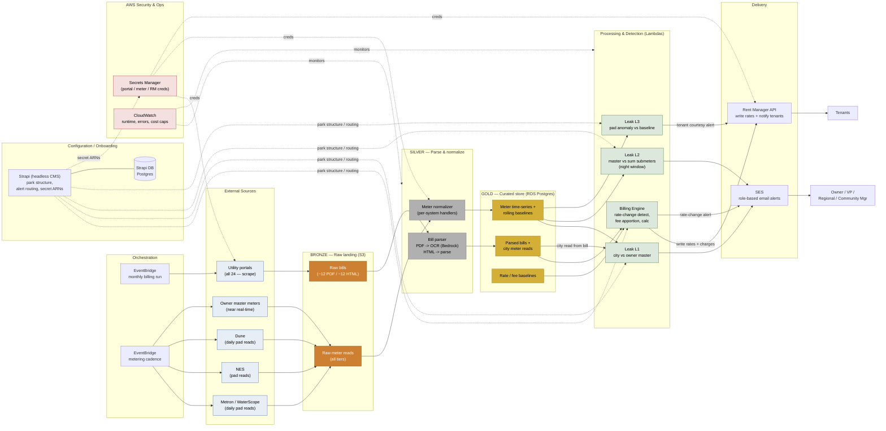

# Park Avenue Partners

## **Deal Context**

Net-new client, no prior relationship with Dual Boot. Park Avenue Partners operates \~24 mobile-home-park communities (\~2,400 pads total, \~100 submeters per park) and expects the portfolio to grow through acquisition. They have no existing AI infrastructure and no enterprise relationships with cloud providers or model makers — this is a greenfield build on an AWS account they will create.

## **People / roles**

**Owner** and **VP of Operations** are the primary alert recipients and decision-makers; **Regional Managers** and **Community Managers** receive property-specific leak alerts.   
Why now: the client is losing money today. Utility rate changes go undetected, causing months-to-years of tenant underbilling; distribution leaks in owner-owned pipes are billed to the owner with no automated way to catch them. Clear, quantifiable ROI is the buying trigger.

## **Business Problem**

Park Avenue is running a portfolio-scale metering-and-billing operation on a manual process. Two jobs to be done:

1. **Stop revenue leakage from stale rates.** Communities are master-metered; the owner receives one utility bill per property and re-bills tenants using per-gallon rates and fixed assessments entered by hand into Rent Manager. When a utility changes its rate or adds a fee, nothing flags it, so tenants are underbilled until someone happens to notice. The job: detect rate/fee changes monthly and keep tenant billing current automatically.  
2. **Stop paying for water that leaks.** Three metering tiers (city master → owner master → pad submeters) are never cross-referenced, so distribution leaks, city-meter faults, and anomalous tenant usage go undetected. The job: reconcile the tiers monthly/daily and alert the right people early, while the fix is still cheap.

If this works, the owner recovers underbilled revenue, catches leaks before they compound, and reduces surprise-billing disputes with tenants — without adding headcount.

## **Current Technical Landscape**

**Tenant / billing platform: Rent Manager.** All integration below assumes Rent Manager.  
**Metering — three tiers:**

* Tier 1 — City master meter. Read from the monthly utility bill, in arrears.  
* Tier 2 — Owner-owned master meter immediately downstream, near-real-time reads.  
* Tier 3 — Pad-level submeters from three systems: Metron/WaterScope, NES, and Dune. Metron and Dune provide daily reads. All three confirmed to have API or dashboard access. WaterScope (Metron) already has some native leak alerting.

**Utility billing delivery**. Bill formats vary by municipality (HTML and/or PDF) regardless of delivery channel. \~50/50 \[ASSUMPTION\] 

**Data flows today:** utility → owner (bill, monthly) → manual rate entry into Rent Manager → tenant charges. Master and submeter data sits in three vendor systems, uncorrelated. No automated pipeline exists.

## **Where the Solution Fits**

A headless, scheduled “ML” pipeline on AWS that sits between the client's data sources (utility bills, three meter systems) and Rent Manager. It reads from the sources, applies deterministic threshold/pattern logic, and writes results back into Rent Manager (rates, charges, tenant notifications) plus email alerts. No custom UI — output surfaces through Rent Manager and email, which fits the "turnkey, low-maintenance" requirement and keeps cost down.

The logic is deterministic and auditable, which lowers risk, cost, and maintenance — the right profile for the budget and for a client with no AI infrastructure.

**Integration surface:**

* **Ingestion in:** 3 meter systems (separate handler per system), \~12 utility portals have bills as HTML, \~12 utility portals have bills as PD. \[ASSUMPTION\]  
* **Compute:** AWS pipeline, Bedrock for the narrow model/OCR needs, cost-capped per run.  
* **Write out:** Rent Manager REST API (rates, fixed-charge line items, tenant email/SMS notifications).  
* **Alerts out:** email to role-based recipient lists, per property.

## **Scope and Assumptions**

### Platform Foundations

**In scope:**

* AWS account configuration (client creates account; Dual Boot leads setup), Bedrock access, consolidated billing.  
* Secrets management (AWS Secrets Manager) for utility portal credentials, scoped read-only where possible.  
* Per-run cost caps / hard budget thresholds to prevent runaway spend.  
* Meter-system ingestion handlers — one per system (Metron/WaterScope, NES, Dune).  
* Rent Manager REST API integration layer (read structure; write rates, charges, notifications).  
* Monitoring via AWS CloudWatch (runtime, error states, cost).  
* Property onboarding workflow — repeatable, documented: add utility portal/email credentials, configure meter API, create Rent Manager community entry, initialize rate baseline. First-class requirement, not an afterthought (portfolio is growing by acquisition).

**Out of scope:**

* Custom end-user UI / dashboard (system is headless by design).  
* Autonomous/agentic decision-making (deterministic logic only).  
* Ongoing portal-maintenance and model-governance labor (candidate for a separate T\&M/retainer line — see Risks).

###  Module A — Billing Engine (UC1)

**In scope:** Monthly retrieval of each utility bill via two ingestion paths — portal scrape and HTML download  (\~12) and portal scrape and PDF download (\~12) — feeding one shared bill-parsing layer (HTML \+ PDF, OCR where needed); detect rate and fee/assessment changes against stored baselines; apportion fixed/improvement fees across units; apply current per-gallon rate; write updated rates and fixed-charge line items to Rent Manager; alert Owner/VP on detected rate changes.

**Out of scope:** Reconciling historical underbilling retroactively (unless explicitly added); handling utilities that neither email nor expose a portal (none identified — flag if found).

### 

### Module B — Leak Detection Engine (UC2)

**In scope, three layers:**

* **Layer 1** — City vs. owner master: compare city bill (monthly, arrears) to owner master reads; sustained discrepancy → possible city-meter fault/billing error → alert Owner, VP.  
* **Layer 2** — Owner master vs. sum of pad submeters: delta indicates a distribution leak in owner-owned pipes; nighttime-window analysis (e.g., 2–4 AM) for high-confidence signal → alert Owner, VP, Regional Manager, Community Manager for that property.  
* **Layer 3** — Pad usage anomaly: each pad vs. its rolling \~30-day baseline; significant spike (e.g., ≥2× average) → courtesy tenant notification via Rent Manager (email/SMS). Daily reads from Dune/Metron enable near-real-time detection.

**Out of scope / open:** whether Layer 3 supplements or replaces WaterScope's native alerting (determines Layer 3 build scope — see Open Questions).

## **Assumptions**

* \[ASSUMPTION\] Rent Manager REST API supports write of rate line items and fixed charges, and tenant SMS/email notifications, at the needed granularity. Rent Manager exposes both legacy SOAP and a newer REST API with documented read/write; which endpoints cover our three needs (write rates, write notifications, read community/pad structure) is unverified.   
* \[ASSUMPTION\] All three meter systems expose a usable API (not dashboard-only) for automated daily/near-real-time pulls; separate handler per system is sufficient.  
* \[ASSUMPTION\] Utility portals allow read-only credential scoping and permit automated login without MFA that blocks headless access.  
* \[ASSUMPTION\] The \~50/50 HTML/PDF split holds and every utility uses at least one of the two channels with retrievable bill history.  
* \[ASSUMPTION\] Bill-format variance across municipalities is bounded enough that a finite set of parsers (built after a format audit) covers the portfolio.  
* \[ASSUMPTION\] \~100 submeters/park and \~2,400 pads total is representative for sizing compute and parsing effort.

## **Proposed Solution Shape \- Medallion architecture**

**Ingestion (Bronze).** Two scheduled paths land raw material in the Bronze S3 bucket. A monthly EventBridge-triggered Lambda handles the \~24 portal utilities: it reads each park's portal credentials from Secrets Manager (by ARN reference held in Configuration/Strapi), logs in, and downloads the current month's bill (HTML or PDF).  On a separate, faster schedule, a metering Lambda connects to the three meter systems (Metron/WaterScope, Dune, NES) and pulls reads from the owner master meters and pad submeters, landing them raw in Bronze as well. Metering runs on its own cadence — daily, not monthly — because leak detection needs that resolution.

**Parse & normalize (Silver).** An ETL Lambda triggered by the S3 event runs Bedrock OCR on PDF bills or parses the HTML, extracts the relevant fields, and writes structured JSON to the Silver bucket. A companion normalizer reconciles the three meter formats into one consistent shape, also in Silver.

**Curate (Gold).** A loader Lambda reads the Silver JSON and writes to the RDS relational database: parsed bills with the city meter reading, meter time-series, and the rolling baselines and rate/fee baselines that detection compares against. At this point bills and measures are query-ready.

**Detection & delivery.** The Billing Engine Lambda (UC1) detects rate and fee changes against the stored baseline, apportions fixed/improvement fees across units, calculates per-tenant charges, writes the updated rates and charge line items to Rent Manager, and emails a rate-change alert. 

Separate leak-detection logic (UC2) runs three layers: Layer 1 compares the city reading (from the parsed bill) against the owner master; Layer 2 compares the owner master against the sum of pad submeters using the 2–4 AM window; Layer 3 checks each pad against its rolling baseline. Every detection component reads the park's structure and alert-routing list from configuration/Strapi to resolve recipients. Alerts split by audience: staff (owner, VP, regional and community managers) receive email via SES; tenants receive notifications through Rent Manager (Layer 3 courtesy alerts and billing).

**Team composition:** part-time data engineer (AWS pipeline, ingestion), integration engineer (Rent Manager \+ meter APIs), part-time ML/data specialist (parsing, anomaly baselines), TL/architect oversight. 

## **Risks and Dependencies**

* Bill-format variance (High, accepted) — primary UC1 scope risk. Formats differ by municipality across both channels (portal HTML and emailed PDF). Retire with a bill-format audit during build, before finalizing the parsing layer.  
* Portal login reliability (Medium, accepted). Portals change session/structure; scrapers break. \~24 portals to maintain. Flag as a T\&M support line, not fixed-fee.  
* Rent Manager API coverage (High, accepted until verified). If REST can't write rates/notifications as needed, the core write path changes. Retire by confirming against rmAPI docs / a sandbox before the estimate hardens.  
* Credentials security (Medium, accepted). Pipeline needs read-level access to portals tied to auto-pay accounts. Scope read-only, document exposure. Client acknowledged and accepted the tradeoff.  
* WaterScope overlap (Medium). Native Metron alerting overlaps Layer 3 — supplement vs. replace determines build scope. Resolve before scoping Layer 3\.  
* Property-acquisition onboarding (Medium, recurring). Not one-time — every acquisition needs portal/meter/Rent Manager setup. Define as a documented T\&M line item separate from the fixed fee to avoid scope disputes.  
* Model drift / pipeline monitoring (Low-Medium, ongoing). Anomaly baselines and pipelines need periodic review. 

## **Open Questions**

1. Rent Manager REST API coverage — does it support write of rate line items, fixed charges, and tenant SMS/email?   
2. Exact PDF/HTML split and per-utility bill formats — confirm the \~12/12 assumption and gather sample bills for the audit.   
3. Layer 3 vs. WaterScope — supplement or replace native Metron alerting?   
4. Meter APIs vs. dashboard-only — is each of Metron/NES/Dune truly API-accessible for automated pulls?   
5. Notification channels — is SMS in scope for tenant alerts, or email only (affects Rent Manager notification path)?
