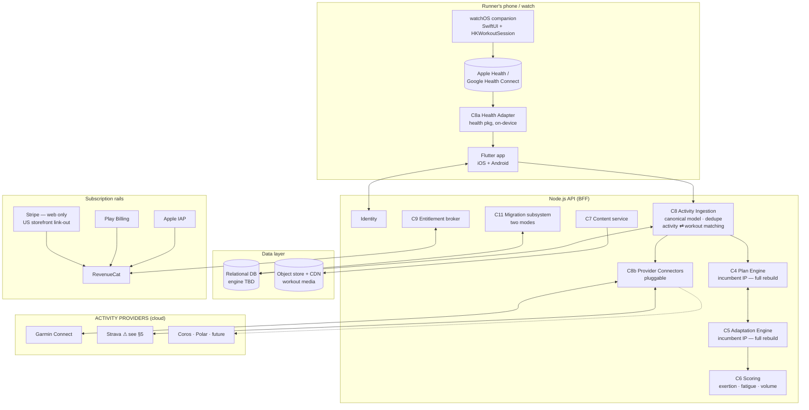

# Run With Hal — Solution Architecture Proposal (Pre-Sales)

**Produced:** 19 Aug 2026 · Sol pre-sales assessment (phases 1–6 complete, Gate 6 PASS)
**Source of record:** `engagements/run-with-hal/solution-architecture.md` in the Sol — Sales Engineer workspace
**Estimate:** ~4,710 h (App Store transfer granted) / ~4,985 h (denied) — AI_CALIBRATED, 21.1% reserve

> **Read [[run-with-hal-target-architecture]] alongside this.** That note is better informed on several points and **contradicts this one on Strava**. Divergences are reconciled in §8 — do not circulate either document without it.

---

## 1. Scope this architecture answers to

Locked 19 Aug 2026:

- **Feature parity + rebrand.** Not the modernised product the client described on the July call.
- **Import-only activity capture.** No native phone GPS tracking — the current app has none either.
- **Native watchOS companion included.** Cannot be Flutter.
- **Gamification, community, challenges, affiliate store excluded.**
- **Design system + redesign of ~39 screens included.** The brand exists in Figma and has never been applied.
- **Activity providers behind a pluggable connector.**

**Stack:** Flutter client · Node.js API · relational database, engine open · RevenueCat for entitlements.

---

## 2. The picture

**The provider box is deliberately generic.** Garmin and Strava are named for launch; adding Coros or Polar later is a connector, not a re-architecture. Everything downstream of C8b sees one canonical activity shape.

---

## 3. The centre of gravity is not the screens

Two capabilities are **incumbent technology IP** and must be rebuilt from the client's book-derived programs with no specification:

- **C4 Plan Engine** — generates a periodised plan from nine wizard inputs.
- **C5 Adaptation Engine** — recomputes forward when a runner misses sessions, without invalidating completed work. Surfaced through eight Plan Settings entry points.

~464 h combined, the widest variance in the estimate, and **essentially no AI velocity credit** (1.6% and 5.7%) because the constraint is missing knowledge, not typing speed. Any competitor pricing "parity" naively will underbid us here.

**A named client-side plan-methodology owner is a contract condition.** Not Spence — someone who knows the programs.

---

## 4. Health data — one package, two unequal platforms

The Flutter `health` package covers Apple Health and Google Health Connect through one API, including workout routes. Three asymmetries:

1. **Google Fit is dead** (deprecated 1 May 2024, removed at package v11.0.0). Android means **Health Connect** — its own permission model, its own minSdk floor. A different integration wearing the same API.
2. **Background delivery is UNVERIFIED.** The promise *"we'll notify you when it's ready to apply to your plan"* needs `HKObserverQuery` + `enableBackgroundDelivery`. Whether the package exposes it or it needs native glue must be confirmed before that epic is committed.
3. **Sources enter at different layers.** Garmin and Strava are cloud-to-cloud and land on the API. Apple Health and Health Connect are device-local and readable only by the client. Hence C8a on-device, C8 on the server — and **matching logic lives in C8 only**. If it forks per source it gets debugged four times and disagrees with itself.

---

## 5. Strava — harder than Garmin, and contested

Verified against the Strava API Agreement (effective 1 Jun 2026) and rate-limit docs on 18 Aug 2026:

- **Access is gated and discretionary.** New apps start at athlete capacity **1**. Self-upgrade reaches **10**. Beyond that requires review, during which no further athletes can authenticate. Strava's words: *"increased access is not a guarantee."*
- **Rate limits are per-application, not per-user** — roughly 1,000 activities/day at the self-upgraded read tier, shared across the entire base. A few thousand active runners exceeds it.
- **The agreement prohibits apps that "compete with or replicate Strava functionality."** Their judgment, not ours — and Spence positioned this product against Strava on the July call.
- **Cross-user data display is barred**, even where public on Strava. Any future leaderboard or challenge feature cannot be built on Strava data.
- **Access is revocable at any time for any reason** and may become paid.
- **§9.5 grants Strava a sublicensable licence to the client's marks** for Strava's marketing.

**This proposal treated Strava as an inbound provider. [[run-with-hal-target-architecture]] treats it as write-only. That note is right — see §8.**

---

## 6. Migration — the actual engagement

The client does not own the Apple App Store developer account. Everything turns on that.

**Mode A — transfer granted.** Listing, install base and IAP subscriptions move to the client's account. Ships as an update to the same app. Force-update, re-authenticate, continue. Subscriptions persist.

**Mode B — transfer denied.** New listing, new account. Users must be emailed, install a different app, re-authenticate and **re-purchase** — Apple entitlements do not cross developer accounts. Adds new store presence, an email reacquisition pipeline, grandfathering logic, a dual-run period and manual account-recovery tooling.

**Required from the incumbent — the highest-value near-term output:**

1. User records **including federated provider subject identifiers** (an email list cannot restore Apple/Google sign-in)
2. Subscription state, terms, renewal dates
3. Historical activity data
4. **In-flight plan state** — a runner nine weeks into a sixteen-week plan who loses it at cutover is guaranteed churn
5. Editorial content export

This list should reach Spence **before** he re-engages the incumbent, while the relationship is still cooperative.

---

## 7. Subscriptions

**RevenueCat** brokers entitlement across Apple IAP, Play Billing and web. **Stripe is web billing only** — Apple guideline 3.1.1 requires IAP for in-app digital unlocks, and Stripe cannot serve that role.

The link-out carve-out is narrower than it looks: free on the **US storefront** (3.1.1(a), 3.1.3), entitlement-gated elsewhere. **The client is Canadian with a US + Canada base**, so an in-app web option needs storefront-conditional logic and getting it wrong is an App Review rejection.

Worth doing anyway: **Apple entitlements do not cross developer accounts; web entitlements do.** That asymmetry is the root cause of the Mode B re-purchase problem. Web billing does not rescue the existing base, but it permanently removes the client's exposure to being held hostage by a platform account holder — which is the reason this engagement exists.

---

## 8. Divergences from [[run-with-hal-target-architecture]]

That note is later, richer, and better informed. Reconciliation:

| Topic | This proposal | Target Architecture note | Resolution |
|---|---|---|---|
| **Strava direction** | Inbound activity provider | **Write-only — posts completed activities, never ingests** | **Adopt write-only.** It sidesteps the rate-limit ceiling entirely and most of the terms risk. Materially better position. |
| Incumbent identity | Unnamed (NDA at time of call) | **Peaksware; Garmin acquired them** | Vault note current. Update the assessment. |
| Database | Relational, engine TBD | PostgreSQL system of record + object storage for **raw FIT files** | Adopt. FIT storage is a real requirement we did not model. |
| **FIT-file parsing** | Not sized | Named, stack-sensitive component | **Gap in our estimate.** Not costed anywhere. |
| **Admin dashboard** | Out of scope | Metabase/Retool on a read replica, minimal by design | **Gap in our estimate.** Cheap, but not zero, and not in the WBS. |
| Backend stack | Node.js (Dualboot constraint) | .NET or Node, decided by staffing | Compatible |
| Web checkout | US-storefront link-out (D6) | Stripe on halhigdon.com | Compatible — ours adds the storefront constraint |
| Apple Watch | Native SwiftUI companion | Native watchOS app | Agree |
| Race registries | Not mentioned | Tier 2, later | Agree — out |
| Onboarding | 10-step wizard rebuilt as-is | **5 questions pre-filled from HealthKit history** | Target note's is a better product. Not in our parity scope — would be net-new. |

**Net effect on the estimate:** FIT parsing and the admin dashboard are unsized. Strava as write-only likely *reduces* connector effort. Neither is large enough to force a revision pass, but both should be named before a number goes to the client.

---

## 9. Open decisions

| # | Decision | Options | Owner |
|---|---|---|---|
| D1 | Who builds the watchOS app | Flutter dev context-switches / add a native iOS engineer | Rodrigo — **neither is in the team blend** |
| D2 | Watch capability | View-only + RPE logging / full HealthKit workout session | Spence — B re-introduces tracking on the wrist |
| D3 | Auth provider | Managed / custom JWT | After federated-identity question resolves |
| D4 | Content authoring | Migrate as-is / build a light CMS | After content sample |
| D5 | Android at launch | Ship both / iOS first | Spence |
| D6 | Storefront-conditional paywall | US-only link-out / IAP only, web by email | Peter + Spence — commercial |
| D7 | Billing engine | RevenueCat Billing / Stripe Billing | Kickoff |
| D8 | **Strava at launch or fast-follow** | Fast-follow / launch dependency | **Recommend fast-follow** |

---

## 10. Team shape — the blend is inverted

| Role | Proposed | Demanded | Utilisation |
|---|---|---|---|
| Designer | 1.0 | ~0.4 | 43% |
| Flutter | 2.0 | ~0.9 | 44% |
| **Node backend** | 1.0 | ~1.4 | **140%** |
| **Native watchOS** | 0 | ~0.2 | **unstaffed** |
| QA | 1.0 | ~0.6 | 58% |
| **PM** | 0.25 | ~0.5 | **210%** |

Backend is the binding constraint and sits on the critical path for the plan engines, ingestion and migration. **Recommended reblend at the same core headcount: 1 Flutter + 2 Node + 1 QA**, designer 0.5 front-loaded, PM 0.5, 0.25 native.

Applying the AI velocity credit moved backend from 146% to 140% — it cannot close the gap, because the savings land on the frontend work that is already over-supplied.

---

## 11. Validation record

Third-party claims checked against primary sources on 18 Aug 2026 rather than asserted:

- Flutter `health` package covers Apple Health + Health Connect — **confirmed**
- Google Fit deprecated 1 May 2024, removed at v11.0.0 — **confirmed**
- HealthKit background delivery via the package — **UNVERIFIED, open**
- Stripe cannot be the in-app purchase mechanism (3.1.1) — **confirmed**
- US storefront link-out permitted without entitlement (3.1.1(a), 3.1.3) — **confirmed**
- RevenueCat brokers Apple + Google + web (RevenueCat / Stripe / Paddle billing engines) — **confirmed**
- Strava athlete capacity 1 → 10 → discretionary review — **confirmed**
- Strava rate limits per-application — **confirmed**
- Strava prohibits competing apps and cross-user data display — **confirmed**

---

## 12. Verdict

**CONDITIONAL GO.** Conditions:

1. App Store transfer position established before contract signature — quote both modes, do not blend them
2. A named client-side plan-methodology owner for specification workshops — not Spence
3. Team reblended per §10
4. Payment structure resolved before the RFP response goes out

Moves to **NO GO** if the incumbent refuses both App Store transfer and export of federated provider identifiers, if gamification returns to scope inside the same budget and window, or if no domain owner is available for the plan engines.
