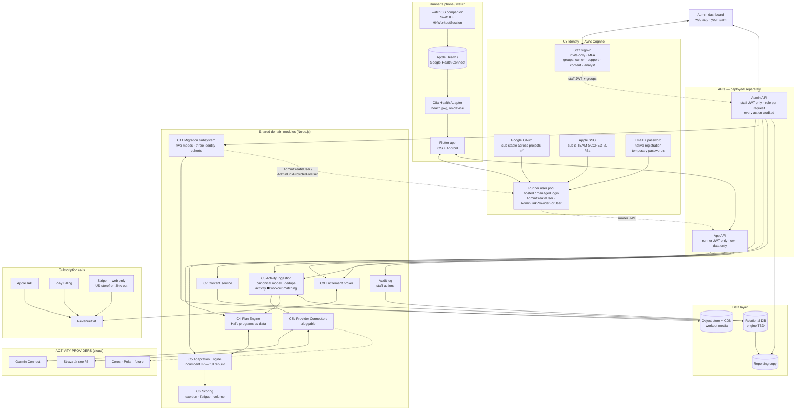

# Run With Hal — Solution Architecture Proposal (Pre-Sales)

**Produced:** 19 Aug 2026 · Sol pre-sales assessment (phases 1–6 complete, Gate 6 PASS)
**Revised:** 4 Oct 2026 — identity provider decided (AWS Cognito, §6a)
**Revised:** 6 Oct 2026 — two isolated APIs: App API for runners, Admin API for the staff dashboard, each with its own Cognito sign-in (§2a)
**Source of record:** `engagements/run-with-hal/solution-architecture.md` in the Sol — Sales Engineer workspace
**Estimate:** ~4,710 h (App Store transfer granted) / ~4,985 h (denied) — AI_CALIBRATED, 21.1% reserve

> **Read [[run-with-hal-target-architecture]] alongside this.** That note is better informed on several points and **contradicts this one on Strava**. Divergences are reconciled in §8 — do not circulate either document without it.

> **⚠ New and schedule-critical:** Sign in with Apple identifiers are team-scoped, and Apple's bridge for an app transfer (`transfer_sub`) **expires 60 days after the transfer**. This inverts the migration sequencing. See **§6a**.

---

## 1. Scope this architecture answers to

Locked 19 Aug 2026:

- **Feature parity + rebrand.** Not the modernised product the client described on the July call.
- **Import-only activity capture.** No native phone GPS tracking — the current app has none either.
- **Native watchOS companion included.** Cannot be Flutter.
- **Gamification, community, challenges, affiliate store excluded.**
- **Design system + redesign of ~39 screens included.** The brand exists in Figma and has never been applied.
- **Activity providers behind a pluggable connector.**

**Stack:** Flutter client · **two Node.js APIs (App API, Admin API)** over shared domain modules · web admin dashboard · relational database, engine open · **AWS Cognito for identity (runner and staff sign-in)** · RevenueCat for entitlements.

---

## 2. The picture

```mermaid
graph TB
    subgraph Device["Runner's phone / watch"]
        FL[Flutter app<br/>iOS + Android]
        HA["C8a Health Adapter<br/>health pkg, on-device"]
        AW[watchOS companion<br/>SwiftUI + HKWorkoutSession]
        HK[(Apple Health /<br/>Google Health Connect)]
    end

    DASH["Admin dashboard<br/>web app · your team"]

    subgraph IdP["C3 Identity — AWS Cognito"]
        CUP["Runner user pool<br/>hosted / managed login<br/>AdminCreateUser · AdminLinkProviderForUser"]
        GOO["Google OAuth<br/>sub stable across projects ✅"]
        APL["Apple SSO<br/>sub is TEAM-SCOPED ⚠ §6a"]
        EML["Email + password<br/>native registration<br/>temporary passwords"]
        STF["Staff sign-in<br/>invite-only · MFA<br/>groups: owner · support · content · analyst"]
    end

    subgraph Edge["APIs — deployed separately"]
        APPAPI["App API<br/>runner JWT only · own data only"]
        ADMAPI["Admin API<br/>staff JWT only · role per request<br/>every action audited"]
    end

    subgraph Backend["Shared domain modules (Node.js)"]
        PE["C4 Plan Engine<br/>Hal's programs as data"]
        AE["C5 Adaptation Engine<br/>incumbent IP — full rebuild"]
        SC[C6 Scoring<br/>exertion · fatigue · volume]
        CT[C7 Content service]
        ING["C8 Activity Ingestion<br/>canonical model · dedupe<br/>activity ⇄ workout matching"]
        CONN["C8b Provider Connectors<br/>pluggable"]
        ENT[C9 Entitlement broker]
        MIG["C11 Migration subsystem<br/>two modes · three identity cohorts"]
        AUD["Audit log<br/>staff actions"]
    end

    subgraph Data["Data layer"]
        DB[(Relational DB<br/>engine TBD)]
        OBJ[(Object store + CDN<br/>workout media)]
        REP[(Reporting copy)]
    end

    subgraph Providers["ACTIVITY PROVIDERS (cloud)"]
        GAR[Garmin Connect]
        STR["Strava ⚠ see §5"]
        FUT[Coros · Polar · future]
    end

    subgraph Rails["Subscription rails"]
        RC[RevenueCat]
        SK[Apple IAP]
        PB[Play Billing]
        ST["Stripe — web only<br/>US storefront link-out"]
    end

    FL <--> CUP
    GOO --> CUP
    APL --> CUP
    EML --> CUP
    CUP -. "runner JWT" .-> APPAPI
    FL <--> APPAPI
    DASH <--> STF
    DASH <--> ADMAPI
    STF -. "staff JWT + groups" .-> ADMAPI
    HA --> FL
    HK --> HA
    AW --> HK
    APPAPI --> PE
    APPAPI --> AE
    APPAPI --> CT
    APPAPI --> ING
    APPAPI --> ENT
    ADMAPI --> ENT
    ADMAPI --> MIG
    ADMAPI --> ING
    ADMAPI --> AUD
    ADMAPI --> REP
    DB --> REP
    AUD --> DB
    ING --> CONN
    CONN <--> GAR
    CONN <--> STR
    CONN -.-> FUT
    ING --> PE
    PE <--> AE
    AE --> SC
    ING <--> DB
    CT --> OBJ
    ENT <--> RC
    SK --> RC
    PB --> RC
    ST --> RC
    MIG <--> DB
    MIG -. "AdminCreateUser /<br/>AdminLinkProviderForUser" .-> CUP
```

**The provider box is deliberately generic.** Garmin and Strava are named for launch; adding Coros or Polar later is a connector, not a re-architecture. Everything downstream of C8b sees one canonical activity shape.

## 2a. Two APIs, isolated responsibilities

**Decided 6 Oct 2026 (Rodrigo).** The web dashboard has its own API, connected to Cognito for staff sign-in and permissions. Each client reaches only the features its users are allowed, through its own API.

- **App API.** Serves the Flutter app and, through the phone, the watch. Accepts runner tokens from the runner user pool only. Every request is scoped to the signed-in runner's own data.
- **Admin API.** Serves the admin dashboard. Accepts staff tokens only. Checks the person's role (Cognito group claim) on every endpoint, and writes every staff action to the audit log: who, what, which runner, when. Reports come from the reporting copy through this API; the dashboard never connects to a database.
- **Token isolation.** Each API pins its own issuer and audience, so a runner token is rejected by the Admin API and a staff token by the App API. A defect or a leaked credential on one side cannot reach the other.
- **Staff sign-in.** Invite-only, multi-factor required, no social providers. Four proposed roles: Owner (everything, manages staff), Support (runner lookup, migration resend, account recovery), Content (Phase 2 editing), Analyst (reports only, no individual accounts). Separate staff pool recommended over groups in the runner pool; decide at kickoff.
- **Shared, not duplicated.** Both APIs call the same domain modules, so a rule like "who has premium" exists once. The APIs are deployed separately, so an admin-side change or outage cannot touch the app.
- **Neither API takes webhooks.** Garmin, Strava and RevenueCat updates land on the connectors and the entitlement module directly.

---

## 3. The centre of gravity is not the screens

Two capabilities are **incumbent technology IP** and must be rebuilt from the client's book-derived programs with no specification:

- **C4 Plan Engine** — generates a periodised plan from nine wizard inputs.
- **C5 Adaptation Engine** — recomputes forward when a runner misses sessions, without invalidating completed work. Surfaced through eight Plan Settings entry points.

~464 h combined, the widest variance in the estimate, and **essentially no AI velocity credit** (1.6% and 5.7%) because the constraint is missing knowledge, not typing speed. Any competitor pricing "parity" naively will underbid us here.

**A named client-side plan-methodology owner is a contract condition.** Not Spence — someone who knows the programs.

---

## 4. Health data — one package, two unequal platforms

The Flutter `health` package covers Apple Health and Google Health Connect through one API, including workout routes. Three asymmetries:

1. **Google Fit is dead** (deprecated 1 May 2024, removed at package v11.0.0). Android means **Health Connect** — its own permission model, its own minSdk floor. A different integration wearing the same API.
2. **Background delivery is UNVERIFIED.** The promise *"we'll notify you when it's ready to apply to your plan"* needs `HKObserverQuery` + `enableBackgroundDelivery`. Whether the package exposes it or it needs native glue must be confirmed before that epic is committed.
3. **Sources enter at different layers.** Garmin and Strava are cloud-to-cloud and land on the API. Apple Health and Health Connect are device-local and readable only by the client. Hence C8a on-device, C8 on the server — and **matching logic lives in C8 only**. If it forks per source it gets debugged four times and disagrees with itself.

---

## 5. Strava — harder than Garmin, and contested

Verified against the Strava API Agreement (effective 1 Jun 2026) and rate-limit docs on 18 Aug 2026:

- **Access is gated and discretionary.** New apps start at athlete capacity **1**. Self-upgrade reaches **10**. Beyond that requires review, during which no further athletes can authenticate. Strava's words: *"increased access is not a guarantee."*
- **Rate limits are per-application, not per-user** — roughly 1,000 activities/day at the self-upgraded read tier, shared across the entire base. A few thousand active runners exceeds it.
- **The agreement prohibits apps that "compete with or replicate Strava functionality."** Their judgment, not ours — and Spence positioned this product against Strava on the July call.
- **Cross-user data display is barred**, even where public on Strava. Any future leaderboard or challenge feature cannot be built on Strava data.
- **Access is revocable at any time for any reason** and may become paid.
- **§9.5 grants Strava a sublicensable licence to the client's marks** for Strava's marketing.

**This proposal treated Strava as an inbound provider. [[run-with-hal-target-architecture]] treats it as write-only. That note is right — see §8.**

---

## 6. Migration — the actual engagement

The client does not own the Apple App Store developer account. Everything turns on that.

**Mode A — transfer granted.** Listing, install base and IAP subscriptions move to the client's account. Ships as an update to the same app. Force-update, re-authenticate, continue. Subscriptions persist.

**Mode B — transfer denied.** New listing, new account. Users must be emailed, install a different app, re-authenticate and **re-purchase** — Apple entitlements do not cross developer accounts. Adds new store presence, an email reacquisition pipeline, grandfathering logic, a dual-run period and manual account-recovery tooling.

**Required from the incumbent — the highest-value near-term output:**

1. User records **including federated provider subject identifiers** — Google `sub` per user, and **a Sign in with Apple transfer-identifier generation run before the app transfer** (§6a). An email list cannot restore federated sign-in.
2. Subscription state, terms, renewal dates
3. Historical activity data
4. **In-flight plan state** — a runner nine weeks into a sixteen-week plan who loses it at cutover is guaranteed churn
5. Editorial content export

This list should reach Spence **before** he re-engages the incumbent, while the relationship is still cooperative.

---

## 6a. Identity — AWS Cognito, and the 60-day Apple deadline

**Decision, 4 Oct 2026: AWS Cognito user pools as the identity provider.** All three reasons given were checked against AWS and Apple documentation and all three hold.

| Claim | Verdict |
|---|---|
| Manages OAuth clients such as Google and Apple SSO | **Confirmed.** Cognito user pools federate Google, Apple, Facebook and Amazon over OAuth 2.0, plus any SAML 2.0 or OIDC provider |
| Allows manual registration with any other email | **Confirmed.** Native email/password sign-up. The Essentials tier — the default for new pools — also brings MFA and passwordless sign-in including passkeys |
| Allows temporary passwords for migrated accounts | **Confirmed.** `AdminCreateUser` issues a temporary password and places the user in `FORCE_CHANGE_PASSWORD`; they set a permanent password at first sign-in through the `NEW_PASSWORD_REQUIRED` challenge. Validity is configurable, re-issuable with `MessageAction=RESEND`, and `AdminSetUserPassword` with `Permanent=true` moves a user straight to `CONFIRMED` |

### The limit that matters

**Temporary passwords only help the email/password cohort.** They do nothing for users who signed in with Apple or Google — there is no password to replace. Federated users are attached to a local profile with `AdminLinkProviderForUser`, which requires the provider's subject identifier. Migration therefore splits three ways, and only one of the three is straightforward.

| Cohort | Mechanism | Needs from the incumbent | Difficulty |
|---|---|---|---|
| **Email + password** | `AdminCreateUser` with a temporary password, or CSV import | Email addresses | **Easy.** Works on the Mode B path too. Password hashes *can* be imported if the algorithm is declared, but we will not get them |
| **Google** | `AdminLinkProviderForUser` keyed on `Cognito_Subject` | Google `sub` per user | **Tractable.** Google's `sub` is unique per Google Account, never reused, and **stable across OAuth clients and projects** — the same human resolves to the same `sub` under our client ID |
| **Apple** | `AdminLinkProviderForUser` consuming Apple's `transfer_sub` | A transfer-identifier generation run by Peaksware **before** the app transfer | **Hard, and time-boxed — below** |

### The 60-day deadline nothing in the plan accounts for

Sign in with Apple identifiers are **team-scoped**: the same human produces a different `sub` under a different Apple Developer team. Apple's only bridge is `transfer_sub`, and it carries three conditions:

1. **The transferring team must generate transfer identifiers before the app transfer.** That is Peaksware — the counterparty we have assumed hostile. If they do not run it, Apple users cannot be matched by any means.
2. **It exists only on the Mode A path.** There must be a real App Store app transfer. In Mode B there is no `transfer_sub`, and the Apple cohort cannot be recovered *as the same account* — they can only start fresh.
3. **`transfer_sub` appears in Apple ID tokens for 60 days after the transfer, and then stops.**

**Condition 3 inverts the sequencing.** The plan to date assumes we secure the App Store transfer early and build at leisure. We cannot. Every Apple user must sign in to the new app within 60 days of the transfer, so **the transfer has to happen close to launch, not at contract signature** — and launch has to sit far enough inside the six-month exit window to leave the capture period intact.

This is a scheduling constraint rather than an effort one, and it is the sharpest thing available to hand Spence for the incumbent negotiation: **the ask is not merely "transfer the app", it is "run the Sign in with Apple transfer-identifier generation before you do."** No competitor bidding from a screen list will know to ask for it.

### Cost and remaining unknowns

Cognito's free tier covers 10,000 MAU on the Lite or Essentials plans; beyond that it bills per MAU. With the user count still unknown (OQ-07) this is an unpriced line item, though small relative to the build.

Still open: what proportion of the base sits in each cohort (OQ-29 in [[run-with-hal-client-question-set]] asks exactly this), and whether Peaksware will run the Apple transfer-identifier generation at all.

---

## 7. Subscriptions

**RevenueCat** brokers entitlement across Apple IAP, Play Billing and web. **Stripe is web billing only** — Apple guideline 3.1.1 requires IAP for in-app digital unlocks, and Stripe cannot serve that role.

The link-out carve-out is narrower than it looks: free on the **US storefront** (3.1.1(a), 3.1.3), entitlement-gated elsewhere. **The client is Canadian with a US + Canada base**, so an in-app web option needs storefront-conditional logic and getting it wrong is an App Review rejection.

Worth doing anyway: **Apple entitlements do not cross developer accounts; web entitlements do.** That asymmetry is the root cause of the Mode B re-purchase problem. Web billing does not rescue the existing base, but it permanently removes the client's exposure to being held hostage by a platform account holder — which is the reason this engagement exists.

---

## 8. Divergences from [[run-with-hal-target-architecture]]

That note is later, richer, and better informed. Reconciliation:

| Topic | This proposal | Target Architecture note | Resolution |
|---|---|---|---|
| **Strava direction** | Inbound activity provider | **Write-only — posts completed activities, never ingests** | **Adopt write-only.** It sidesteps the rate-limit ceiling entirely and most of the terms risk. Materially better position. |
| Incumbent identity | Unnamed (NDA at time of call) | **Peaksware; Garmin acquired them** | Vault note current. Update the assessment. |
| Database | Relational, engine TBD | PostgreSQL system of record + object storage for **raw FIT files** | Adopt. FIT storage is a real requirement we did not model. |
| **FIT-file parsing** | Not sized | Named, stack-sensitive component | **Gap in our estimate.** Not costed anywhere. |
| **Admin dashboard** | Out of scope (Aug) → **web app with its own Admin API, staff sign-in and roles (6 Oct, §2a)** | Metabase/Retool on a read replica, minimal by design | **Resolved toward this note's §2a**; the Target Architecture note has been updated to match. Still a **gap in the August estimate**: the Admin API, staff roles and audit log are not in the WBS. |
| Backend stack | Node.js (Dualboot constraint) | .NET or Node, decided by staffing | Compatible |
| **Identity** | **AWS Cognito (decided 4 Oct, §6a)** | "Users, auth (Sign in with Apple / Google / email — with the returning-user detection flow)" | Compatible — Cognito is the mechanism for the returning-user detection that note describes |
| Web checkout | US-storefront link-out (D6) | Stripe on halhigdon.com | Compatible — ours adds the storefront constraint |
| Apple Watch | Native SwiftUI companion | Native watchOS app | Agree |
| Race registries | Not mentioned | Tier 2, later | Agree — out |
| Onboarding | 10-step wizard rebuilt as-is | **5 questions pre-filled from HealthKit history** | Target note's is a better product. Not in our parity scope — would be net-new. |

**Net effect on the estimate:** FIT parsing and the admin dashboard are unsized. Strava as write-only likely *reduces* connector effort. Cognito likely reduces C3 effort versus a hand-built auth service, while adding the three-cohort migration work in §6a. None is large enough to force a revision pass, but all should be named before a number goes to the client.

---

## 9. Open decisions

| # | Decision | Options | Owner |
|---|---|---|---|
| D1 | Who builds the watchOS app | Flutter dev context-switches / add a native iOS engineer | Rodrigo — **neither is in the team blend** |
| D2 | Watch capability | View-only + RPE logging / full HealthKit workout session | Spence — B re-introduces tracking on the wrist |
| ~~D3~~ | ~~Auth provider~~ | **RESOLVED 4 Oct 2026 — AWS Cognito user pools (§6a)** | — |
| D4 | Content authoring | Migrate as-is / build a light CMS | After content sample |
| D5 | Android at launch | Ship both / iOS first | Spence |
| D6 | Storefront-conditional paywall | US-only link-out / IAP only, web by email | Peter + Spence — commercial |
| D7 | Billing engine | RevenueCat Billing / Stripe Billing | Kickoff |
| D8 | **Strava at launch or fast-follow** | Fast-follow / launch dependency | **Recommend fast-follow** |
| **D9** | **When the App Store transfer happens** | **At contract signature / close to launch** | **Peter + Spence. The 60-day `transfer_sub` window forces "close to launch" — see §6a** |
| **D10** | **Staff identity** | Separate Cognito user pool for staff (recommended) / groups in the runner pool | Kickoff. Either works if each API pins its issuer and audience (§2a). Confirm the four staff roles with the client. |

---

## 10. Team shape — the blend is inverted

| Role | Proposed | Demanded | Utilisation |
|---|---|---|---|
| Designer | 1.0 | ~0.4 | 43% |
| Flutter | 2.0 | ~0.9 | 44% |
| **Node backend** | 1.0 | ~1.4 | **140%** |
| **Native watchOS** | 0 | ~0.2 | **unstaffed** |
| QA | 1.0 | ~0.6 | 58% |
| **PM** | 0.25 | ~0.5 | **210%** |

Backend is the binding constraint and sits on the critical path for the plan engines, ingestion and migration. **Recommended reblend at the same core headcount: 1 Flutter + 2 Node + 1 QA**, designer 0.5 front-loaded, PM 0.5, 0.25 native.

Applying the AI velocity credit moved backend from 146% to 140% — it cannot close the gap, because the savings land on the frontend work that is already over-supplied.

---

## 11. Validation record

Third-party claims checked against primary sources rather than asserted.

**18 Aug 2026**

- Flutter `health` package covers Apple Health + Health Connect — **confirmed**
- Google Fit deprecated 1 May 2024, removed at v11.0.0 — **confirmed**
- HealthKit background delivery via the package — **UNVERIFIED, open**
- Stripe cannot be the in-app purchase mechanism (3.1.1) — **confirmed**
- US storefront link-out permitted without entitlement (3.1.1(a), 3.1.3) — **confirmed**
- RevenueCat brokers Apple + Google + web — **confirmed**
- Strava athlete capacity 1 → 10 → discretionary review — **confirmed**
- Strava rate limits per-application — **confirmed**
- Strava prohibits competing apps and cross-user data display — **confirmed**

**4 Oct 2026 — identity**

- Cognito user pools federate Google, Apple, Facebook, Amazon over OAuth 2.0, plus SAML 2.0 and OIDC — **confirmed**
- Cognito supports native email/password registration; Essentials tier adds MFA and passkeys — **confirmed**
- `AdminCreateUser` temporary password → `FORCE_CHANGE_PASSWORD` → `NEW_PASSWORD_REQUIRED`; expiry configurable, `MessageAction=RESEND` re-issues; `AdminSetUserPassword` + `Permanent=true` → `CONFIRMED` — **confirmed**
- `AdminLinkProviderForUser` links a federated identity to a pre-created local profile; social IdPs link on `Cognito_Subject` — **confirmed**
- CSV import sets `RESET_REQUIRED` unless password hashes are supplied with a declared algorithm — **confirmed**
- Migrate-user Lambda trigger can migrate at first sign-in, but requires validating credentials against the old system — **confirmed** (not viable here: no access to Peaksware's directory)
- Google `sub` is unique per Google Account, never reused, stable across OAuth clients and projects — **confirmed**
- **Sign in with Apple identifiers are team-scoped; `transfer_sub` is generated by the transferring team before transfer and appears in ID tokens for only 60 days afterwards** — **confirmed**
- Cognito free tier 10,000 MAU on Lite/Essentials; per-MAU beyond — **confirmed**

---

## 12. Verdict

**CONDITIONAL GO.** Conditions:

1. App Store transfer position established before contract signature — quote both modes, do not blend them
2. A named client-side plan-methodology owner for specification workshops — not Spence
3. Team reblended per §10
4. Payment structure resolved before the RFP response goes out
5. **The Sign in with Apple transfer-identifier generation is added to the incumbent ask, and the transfer is sequenced close to launch to stay inside Apple's 60-day window (§6a, D9)**

Moves to **NO GO** if the incumbent refuses both App Store transfer and export of federated provider identifiers, if gamification returns to scope inside the same budget and window, or if no domain owner is available for the plan engines.
