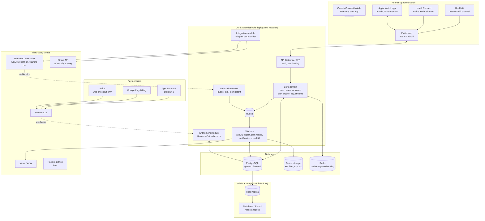

# Run With Hal — Target Architecture

**Scope:** new application (Flutter, iOS + Android), backend API, third-party integrations, payments, minimal admin dashboard.
**Design constraints from the engagement:** hostile-handoff survivability, Apple-first data strategy, budget concentrated on the app rather than internal tooling.

---

## 1. The picture



Paste the block above into any Mermaid renderer, or I can generate it as a FigJam board next to your flow board.

---

## 2. Component by component

### 2.1 Flutter app

One codebase, iOS and Android, as you specified. Three places where Flutter alone isn't enough:

**Native health channels.** HealthKit has no server API — it's an on-device framework. Same for Health Connect on Android. The Flutter app talks to them through platform channels: a thin Swift layer for HealthKit, a thin Kotlin layer for Health Connect. Community plugins exist (the `health` package wraps both), but budget for owning that layer — it's load-bearing. It does three jobs:
- **Read at onboarding** — the history that pre-fills the wizard (volume, pace, suggested level).
- **Write after every run** — so the user's data lives on *their* device. This is the hostile-handoff lesson applied to ourselves: if Hal's family ever changes vendor again, their users' history survives in Apple/Google's layer, not just our database.
- **Background delivery** — HealthKit can wake the app when new workouts arrive, keeping the plan current without the user opening it.

**Apple Watch companion app.** `watch_integration` scores 3.17 in the review corpus; a real watchOS app (today's workout on the wrist, start/stop, live intervals) is the answer for Apple Watch runners. This is Swift/SwiftUI, not Flutter — Flutter doesn't target watchOS. Small, separate, native deliverable that shares the backend API.

**Garmin runners need none of this on-device.** Their data path is watch → Garmin Connect Mobile → Garmin cloud → our backend. The app's only Garmin job is the OAuth connect button and showing sync status.

### 2.2 Backend API

**Shape: modular monolith, single deployable.** Not microservices. The team is small, the domain is one bounded product, and the budget priority you stated is the app. Modules with hard internal boundaries (core domain / integrations / entitlements) so anything can be split out later if scale demands it. It won't for a long time — this is a marathon-training app, not a social network; write volume is a few activities per user per day, heavily morning-clustered.

**Stack: your call stands — any of .NET, Node/TypeScript, Ruby, Java carries this.** The workload is ordinary: REST, OAuth token management, webhook processing, background jobs. Pick by bench availability. Given DBP's LATAM bench, .NET or Node/TypeScript are the pragmatic picks; both have first-class Stripe, RevenueCat and queue tooling. The one genuinely stack-sensitive component is FIT-file parsing (Garmin's binary activity format) — mature parsers exist for Java/Kotlin, .NET, JS and Python, so no stack is eliminated. Decide by who you can staff, not by benchmark charts.

**Core domain module** owns what makes this product this product:
- Users, auth (Sign in with Apple / Google / email — with the returning-user detection flow from the migration design).
- **Plan engine**: Hal's licensed program structures + the instantiation logic (the 10-step wizard's output). Deterministic scheduling; the part the debate sized at weeks, not quarters.
- **Adjustment engine**: the rebuilt "Hal Says" logic, now fed by observed training data instead of guessed inputs. Keep it a separate internal service boundary from day one — it's the component most likely to iterate.
- Workouts, completed activities, plan history — the "album" Tom cares about, modeled explicitly so it never again lives only as incidental state.

**API gateway / BFF**: single entry point for the Flutter app and the watch app. Token auth, rate limiting, versioned REST. Nothing exotic.

### 2.3 Integration module — the adapter layer

One internal contract, one adapter per provider:

```
interface ActivityProvider {
  connect(user) → OAuth flow
  handleWebhook(payload) → normalized Activity
  requestBackfill(user, range)
  disconnect(user)
}
```

- **GarminAdapter** — full implementation: Activity + Health APIs inbound, Training API outbound (workout push to watch), backfill for history recovery.
- **StravaAdapter** — **write-only**, per the terms analysis. Posts completed activities with plan context ("Week 11 · Tempo · Hal Higdon Intermediate 1"). Never ingests.
- **HealthKit / Health Connect** — not adapters here; they live on-device (§2.1) and arrive at the backend as already-normalized uploads from our own app. Same normalized `Activity` model at rest.
- **CorosAdapter, PolarAdapter…** — stubs behind the same interface, built when partnerships land.

Why the ceremony: Strava rewrote its terms with 30 days' notice; Garmin bought the incumbent. The adapter boundary is the specific lesson of the last twenty months — losing a provider must cost us a source, not the product.

**Webhook receiver** is its own thin, public, boring component: verify signature, drop the payload on the queue, return 200 in milliseconds. All real work happens in workers. Garmin retries deliveries, so processing is idempotent (dedupe on Garmin's activity ID). Expect the 6–8 a.m. sync spike per timezone; the queue absorbs it.

**Workers** (same codebase, separate process): activity normalization + FIT parsing, plan recalculation after new activities, Garmin backfill jobs (async, chunked, through the same webhook), notification fan-out, Strava posting.

### 2.4 Data layer

**PostgreSQL as the system of record.** Users, plans, plan instances, workouts, activities, provider connections, entitlements. Activity streams (per-second GPS/HR) don't belong in relational rows — store raw FIT files in **object storage** (S3 or equivalent) keyed by activity, keep computed summaries (distance, pace, splits, HR zones) in Postgres. That keeps the database small, fast and cheap while preserving full fidelity for future features.

**Redis** for session/cache and as the queue backing (or SQS/equivalent if on AWS — either is fine; don't build a Kafka cluster for this workload).

**Read replica** feeds the dashboard so analytics queries never touch the production write path.

One schema decision with contractual weight: **make data export a first-class feature** — per-user export (GDPR/CCPA anyway) and full-account export. Write it into our own engagement terms with the Higdon family. We should be contractually incapable of doing to them what Peaksware is doing now. That's also a differentiator no other bidder will offer unprompted.

### 2.5 Payments

Three rails, one truth:

| Rail | Where | Why |
|---|---|---|
| **StoreKit 2 (IAP)** | iOS app | Mandatory for digital subscriptions sold in-app; also the continuity path if the app record transfers (existing Hal+ auto-renewals keep working) |
| **Google Play Billing** | Android app | Same, Play side |
| **Stripe** | Web checkout on halhigdon.com | No store fee; gift subscriptions; corporate/club plans; and a re-acquisition path for lapsed users reachable by email but not by app |

**RevenueCat sits above all three** and is the only thing the backend trusts about entitlement. Its webhooks land in the entitlement module; Postgres stores the resulting entitlement state; the app asks our API "what is this user entitled to," never the stores directly. This is also Ruth's billing-dispute answer: one screen showing a user's full purchase state across every rail, including anything inherited through an app transfer.

(US-only note: post-*Epic* rules allow linking out to web payment from the iOS app. Treat as an optimization to evaluate later, not a v1 dependency.)

### 2.6 Admin dashboard — deliberately minimal

Per your budget instruction: **don't build one.** Point **Metabase** (self-hosted, free) or **Retool** at the read replica.

v1 contents, one afternoon of query-writing:
- Active users, new signups, plan starts by distance/level
- Subscription state (from RevenueCat's own dashboard, embedded or linked — don't rebuild it)
- Integration health: Garmin webhook success rate, backfill queue depth, Strava post failures
- Support lookup: find user → connections, entitlement, last sync (Ruth's two-minute answer)

A custom admin app is a v2 conversation the client has to ask for. Every hour spent there is an hour not spent on the funnel that's costing them ratings.

### 2.7 Notifications

APNs + FCM behind one internal notification service, driven by workers. First use cases: "tomorrow's workout" nudge, sync-failure alerts ("we haven't seen a run from your Garmin in 5 days — reconnect?"), and plan-adjustment explanations. That last one is a product answer to "adjustments seem really off": when the engine changes a week, *tell the runner why*.

---

## 3. The flows that matter

**A. Garmin runner finishes a run**
Watch → BT → Garmin Connect Mobile → Garmin cloud → webhook → our receiver → queue → worker normalizes (FIT to summary + object storage) → plan engine marks workout complete, recalculates if needed → push notification → app shows it. Four external hops before our door; everything after it is ours and observable.

**B. Apple Watch runner finishes a run**
Our watchOS app records → HealthKit → background delivery wakes the Flutter app → upload to API → same normalization path from the queue onward. Zero third-party clouds. This is why Apple-first survives anything.

**C. New user onboarding (the funnel fix)**
Sign in → HealthKit/Health Connect read permission → app uploads 90-day summary → backend computes volume + easy pace, recommends level → wizard is 5 questions with pre-filled answers instead of 10 blank ones → plan instantiated → (if Garmin connected) Training API pushes week 1 to the watch.

**D. Returning user, hostile handoff**
Sign in with Apple → new team-scoped ID, no match → **never show a silent empty account**: "Have you used Run With Hal before?" → yes → reconstruction: HealthKit/Garmin backfill pulls history → plan-inference suggests "these 18 weeks look like Novice 2 ending at a race on Oct 12 — was that Chicago?" → confirm → album partially rebuilt.

**E. Subscription state change**
Store event → RevenueCat webhook → entitlement module updates Postgres → app reflects on next launch. Refund/billing dispute → Ruth reads one RevenueCat screen.

---

## 4. What v1 explicitly excludes

Social/community features, web app for runners (web is checkout only), custom admin UI, COROS/Polar/Suunto adapters (stubs only), the audio/podcast content platform, race-registry integration (Tier 2), any ML-based coaching beyond the deterministic adjustment rules. Each is a named later, not a hidden never.

---

## 5. Open decisions

1. **Backend stack** — .NET vs Node/TypeScript, decided by staffing, not benchmarks.
2. **Cloud + region** — nothing here is cloud-specific; pick where DBP has operational muscle.
3. **The `health` Flutter plugin vs owning the native channels outright** — prototype first; this layer is too important to inherit bugs in.
4. **Whether the plan/adjustment engine needs its own service boundary at deploy time** or stays an internal module — start internal, split only when iteration speed demands it.
5. **Analytics eventing** (Amplitude/PostHog) — cheap to add at v1, painful to retrofit; recommend deciding before first release even if dashboards wait.