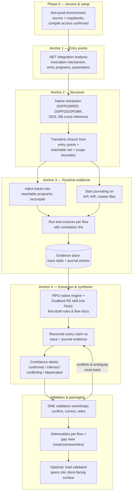
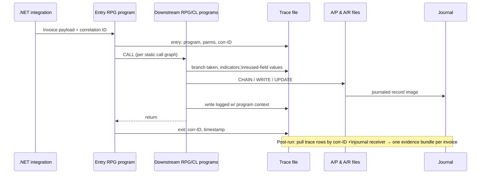
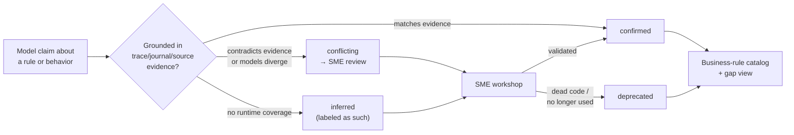

# Technical Intake Brief — Pacific Seafood AS/400 Invoice-Flow Discovery POC

## 1. Business problem

Pacific Seafood runs core A/P and A/R behavior on a heavily customized AS/400 (IBM i) built in early-1990s RPG 400. They are mid-flight on a D365 ERP program, and the business logic that governs invoice processing is undocumented — it lives in code whose behavior depends on runtime context, reused fields, and implicit RPG-cycle execution. If that logic stays hidden, it surfaces as defects during D365 testing or as broken financial behavior after go-live.

The POC: document what the AS/400 *actually does* when three specific invoice flows arrive through an existing .NET integration — (1) PGT bills a Pacific Seafood location, (2) PGT bills a third party, (3) PGT receives a freight-carrier invoice — with focus on resulting A/P and A/R posting behavior. Gene (client sponsor) framed it explicitly as de-risking: compare what the business *believes* happens against what the box *actually does*, and surface the gaps before D365 does.

This is also a test of method. If the approach proves out on three flows, the client's stated path is to scale it across the product (see §4, business development plan).

## 2. North star & success criteria

**North star:** Pacific's SMEs sign off that the documented invoice flows accurately reflect current AS/400 behavior, and the findings are usable for D365 process design and testing.

**Success criteria:**

1. For each of the three flows, an end-to-end current-state narrative from .NET ingress to final A/P or A/R posting, with every business rule evidence-linked and confidence-labeled.
2. A gap view separating behavior already covered by Pacific's requirements from hidden legacy logic not yet reflected in ERP planning, sorted retain / review / retire.
3. Runtime evidence (journal + trace) confirms the documented posting behavior for the executed test cases — claims are observed, not just plausible.
4. Pacific SME validation sessions close with agreement, corrections logged, and no unresolved "conflicting" items in the rule catalog.
5. The method is demonstrably repeatable on the next process family (this is what converts the POC into the scale engagement).

Success is defined by confidence, not documentation volume.

## 3. Client & buyer map

- **Gene** — client sponsor; owns the de-risking framing. `[ASSUMPTION]` economic buyer or close to it; exact title unconfirmed (OQ-01).
- **Ryan** — client technical voice; described the system as understandable only via specific execution pathways. Champion candidate for the technical argument.
- **PGT finance/operations stakeholders** — understand invoice behavior from the business side; needed for validation (names unconfirmed, OQ-02).
- **Dualboot side:** Tony Sturgeon (deal owner; success-criteria call with client pending), Billy Boozer, Andrew Kulakov (delivery; SOW condition: no tool lock-in), Artem Petrov (orchestration/skill), Rodrigo Fernandez (sales engineering).

Deal history: lead originated from a 3PO demo two years ago. The client never asked for 3PO by name — they want the documentation outcome, tool-agnostic. Positioning rule from the deal team: sell the methodology, never "we ran it through Bob" (client would conclude they can do it themselves).

## 4. Current landscape

| System / asset | Role in POC | Note |
| --- | --- | --- |
| AS/400 RPG 400 + CL codebase | **Analyze** | Early-1990s System/36-style; multi-member files; reused generic fields; implicit RPG-cycle behavior; still actively modified (not frozen) |
| .NET integration | **Entry point** | Receives all three invoice flows; invocation mechanism into AS/400 unconfirmed (OQ-03) |
| Integration perimeter (EDI, AS/400→SQL replication, BI stores, OLAP, other .NET apps) | **Map, mostly out** | Invoice logic doesn't fully begin/end inside the AS/400; some logic is mediated by surrounding layers — perimeter must be mapped even where not analyzed |
| Pacific's prior artifacts (requirements, swim lanes, process docs) | **Grounding input** | Required for the gap view; availability assumed (A-04) |
| D365 ERP program | **Downstream consumer** | POC outputs feed its process design and testing; no D365 work in scope |

Constraint from client: they cannot selectively extract only invoice-relevant code. Analysis may sweep the wider environment; deliverables stay bounded to the three flows (the reachable-set derivation in §6 makes that boundary defensible).

Business development plan behind the POC (Tony): 1) prove the methodology on three flows → 2) scale across the product → 3) identify peripheral apps to modernize and AS/400 functionality better suited to AI workflow automation than Dynamics customization → 4) expand into data readiness and AI.

## 5. Scope edges

**In scope:** the three named invoice flows from .NET ingress through final AS/400 posting behavior; AS/400 RPG/CL assets on those paths; the .NET integration logic; SQL/BI bridge points *where they participate in the invoice path*; trace instrumentation of the reachable set in non-prod; SME validation workshops; the deliverable set in §8.

**Explicitly out:** broader process families; full ERP design or any D365 implementation work; modernization, re-platforming, or rewriting the AS/400; production changes of any kind (instrumentation is non-prod only); documentation of programs outside the derived reachable set; efficacy of Pacific's future-state ERP design (we document current state and flag ERP relevance, we don't design the target).

## 6. Discovery execution — four anchors

The approach is evidence-based, not a static reading of RPG. Three anchors produce ground truth; the fourth consumes it.

**Anchor 1 — .NET boundary as entry point.** The integration code is legible modern code. It tells us exactly how the AS/400 is invoked (program call, stored procedure, data queue, file drop — OQ-03) and with what parameters. This converts "analyze the estate" into "start from these named entry programs."

**Anchor 2 — deterministic structure extraction.** Before any model touches code, pull the call graph and data map with native IBM i tooling: `DSPPGMREF` (program → program/file references), DB cross-reference files, `DSPFD`/`DSPDBR` (file definitions and relationships), DDS record layouts. From the entry points, compute the transitive closure of reachable programs and files. That set **is** the scope boundary — derived, not guessed. Everything outside it is out of scope by construction, which neutralizes "we can't isolate the code."

**Anchor 3 — runtime ground truth.** In non-prod, run representative invoices for each flow with database journaling on (`STRJRNPF`) and trace calls injected into the reachable programs. Journaling captures *what changed* (the actual A/P and A/R writes). Traces capture *which path executed and why* — branch taken, indicator state, the live value of a reused field at that moment. Trace placement in ROI order: branch/decision points, file writes (WRITE/UPDATE/DELETE plus feeding CHAINs), program entry/exit, reused-field snapshots, and the .NET→RPG handoff carrying a correlation ID end to end. Traces go to a structured physical file (correlation ID, timestamp, job, program, tag, field, value), not raw TXT — machine-ingestible and isolatable per run.

**Anchor 4 — grounded extraction and synthesis engine.** Consumes anchors 1–3 and turns evidence into documented business logic. An RPG-native engine provides native connect/compile (what makes trace injection feasible), fixed-form→free-form transform as a reading aid (analysis-only, never deployed), and first-draft explain/document. A Dualboot reverse-engineering skill wraps it, encoding the eight hard traits of this environment (member routing and library-list context, field reuse, RPG-cycle semantics, the integration perimeter, among them) as explicit steps the agent must check rather than flatten. Orchestration via Flow, or manually with SMEs in early passes. Validated output loads into 3PO as the client-facing spec surface if Pacific wants it. Tool names stay internal; the SOW commits to outcomes, not tools.

### Execution pipeline

### One instrumented invoice run

### Claim lifecycle (trust mechanism)

## 7. Trust mechanism

The model never guesses what happens; its job is to explain why the journal and trace show what they show. Every claim links to a concrete evidence source; any claim contradicting runtime evidence is auto-flagged. Divergence between models routes to SME review. SMEs validate before anything is final.

Coverage caveat, stated openly: traces only prove the paths the test invoices exercise. Test cases are designed to hit known branches (including error and exception paths where feasible), and unexercised logic ships labeled `inferred`, never silently blended with confirmed behavior.

## 8. Deliverables (per invoice flow)

- Current-state narrative, .NET ingress → final posting.
- Feature / user-story / use-case documentation, evidence-linked.
- ERD segments for the files and fields on the path.
- Mermaid workflow diagrams of the end-to-end process.
- Business-rule catalog with confidence and validation status.
- Gap view: observed behavior vs Pacific's existing requirements — hidden legacy logic flagged, findings sorted retain / review / retire for ERP relevance.

## 9. Top risks

1. **Runtime access not granted** [HIGH/Critical] — no non-prod box or no compile access collapses anchors 3 and the trust story with it; approach degrades to static extraction + SME-only validation, which changes success criteria and pricing. Being pushed for now (A-01).
2. **RPG 400 comprehension gap** [HIGH] — implicit cycle behavior and fixed-format idioms are weak spots for current LLMs (IBM's own watsonx-for-i team flagged this). Mitigation: anchors 1–3 remove most inference burden; skill encodes the hard traits; cross-model divergence routes to SME.
3. **Recompile failures** [MED/HIGH] — missing `/COPY` copybooks or target-release mismatches block instrumentation per program. Fallback: native debug trace (`STRDBG`/`TRCJOB`) for non-compilable programs.
4. **Field reuse / context-dependent meaning** [MED] — static interpretation produces false documentation. Mitigation: reused-field snapshots in traces; ambiguity log tied to program context.
5. **Trace coverage gaps mistaken for completeness** [MED] — unexercised branches look documented. Mitigation: explicit `inferred` labeling; test cases designed against the branch inventory from anchor 2.
6. **Engine data governance** [MED, unresolved] — whether the RPG-native engine transmits source outside Pacific's environment is unknown (OQ-05). Gate before the tool enters the stack.
7. **Live codebase drift** [LOW/MED] — system is still being modified. Mitigation: snapshot the analyzed library set; record source-change dates in evidence bundles.

## 10. Customer inputs required

1. Non-prod IBM i environment with authority to run the three flows, start journaling, and compile instrumented programs (A-01, gating).
2. Read-only source for the reachable set **plus all** `/COPY` **copybooks and correct target release** (A-03).
3. Access to the .NET integration code and any SQL artifacts on the invoice path (A-02).
4. Existing requirements, swim lanes, and process documentation (A-04, required for the gap view).
5. Representative invoice cases per flow, including edge/error cases where known (A-05).
6. SME roster and availability: AS/400 technical, integration/BI, PGT finance/operations (A-05).

## 11. Open questions

- OQ-01: Who is the economic buyer? Gene's exact role and authority?
- OQ-02: Named PGT finance/ops SMEs for validation workshops?
- OQ-03: .NET→AS/400 invocation mechanism — program call, stored procedure, data queue, or file drop? (Everything in anchor 1 hangs on this.)
- OQ-04: Non-prod environment: exists today, or must be provisioned? Refresh cadence from prod?
- OQ-05: Does the RPG-native engine transmit source outside Pacific's environment (deployment model, data governance)? Gate for tool inclusion.
- OQ-06: Can the reachable-set programs be recompiled cleanly in non-prod (copybooks, target release, compile environment)?
- OQ-07: What does Pacific consider "done" — SME sign-off per flow, or an acceptance review board? (Tony to nail success definition in next call.)
- OQ-08: Timeline pressure from the D365 program — when do these three flows enter D365 testing?