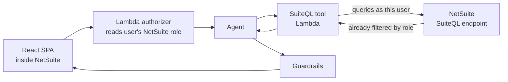
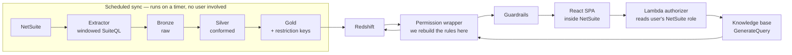
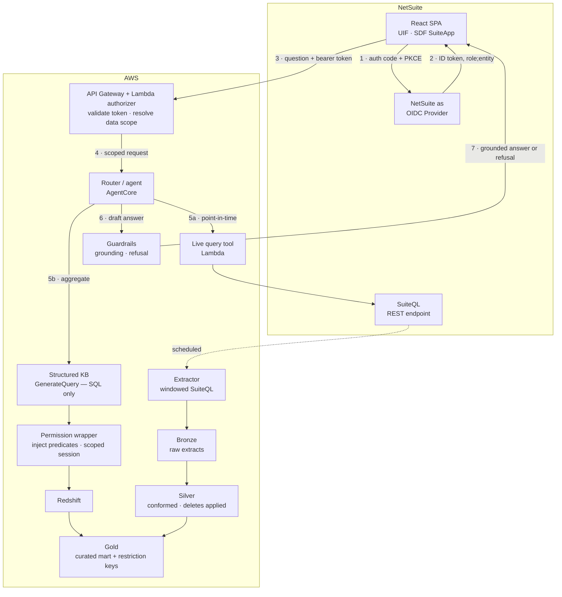

# WG Henschen — Preliminary Architecture (RAG over NetSuite)

Draft for the Friday 14 Aug send to David, ahead of the call next week. High-level picture and open questions only — no pricing.

Evidence base is [[wg-henschen-netsuite-integration-options]]; the constraints cited below are from Oracle and AWS documentation, not estimates. Scope context in [[wg-henschen-rag-scope-call-notes]].

## The constraint that shapes everything

**Decided (Dualboot, 13 Aug):** the assistant must respect each user's existing NetSuite permissions. Two people asking the same question get different answers if NetSuite says they should. This is a requirement, not a preference, and it is not traded against cost or schedule.

That decision belongs first because of what follows from it.

NetSuite enforces data access through roles — subsidiary, department, location, class, employee. When we query NetSuite directly, those restrictions apply automatically and correctly. **When we copy data into a warehouse to make it fast, they do not.** A data lake has no concept of a NetSuite role.

| | Freshness | Permissions | Query cost | Aggregates |
|---|---|---|---|---|
| **Query NetSuite live** | Real-time | **Inherited automatically** | Slow; consumes a shared account-wide concurrency budget | Poor |
| **Replicate to a warehouse** | Batch — hourly or nightly | **Must be rebuilt** | Fast and cheap | Strong |

Neither column wins outright, which is why the proposal below uses both and routes between them per question. *"How many of part 47-A do we have right now, and is any of it allocated"* goes live and comes back correctly scoped with no permission code on our side. *"What is our total on-hand value by category this quarter"* needs the warehouse — and every row that lands there is a row whose access rules we now own.

The open question is no longer *whether* to reproduce their permission model. It is *how faithfully we can do it cheaply*, and that depends entirely on the shape of their restrictions — which we have not seen. See **Permission model** below.

## Architecture

Three diagrams follow, but **there is only one proposal**. A and B are the two pure approaches drawn in isolation, so the trade-off above is legible; C is what we actually recommend and contains both.

The difference to watch for is the **scheduled sync**. In A there is none — nothing is copied anywhere, and every answer comes from NetSuite at the moment it is asked. B and C add a pipeline that copies data out of NetSuite on a timer, entirely independent of anyone asking a question.

| | A — Live only | B — Replicated only | C — Proposed |
|---|---|---|---|
| Scheduled sync out of NetSuite | No | Yes | Yes |
| S3 + Glue + Redshift | No | Yes | Yes |
| Permission code we have to write | None | All of it | Only for warehouse questions |
| Answers "right now" accurately | Yes | No — as stale as the last sync | Yes |
| Answers totals and trends over history | Poorly, and slowly | Yes | Yes |
| Load on their NetSuite | Every question | Sync only | Sync + live questions |

### A — Live only

Every question becomes a SuiteQL query against NetSuite, issued under the asking user's own token. NetSuite filters the results by that user's role before they ever reach us.

**Why it appeals:** no data platform, no copies of their data anywhere, and the permission requirement is satisfied by NetSuite itself at zero engineering cost.

**Why it isn't enough on its own:** NetSuite caps concurrent API requests account-wide — as few as five on a Standard tier, shared with every other integration they run. Aggregate questions over long history are slow or impossible within that budget, and heavy use would degrade their existing integrations.

### B — Replicated only

A scheduled pipeline copies NetSuite into S3 and refines it through bronze, silver and gold layers. Questions are answered from Redshift, never from NetSuite.

**Why it appeals:** fast, cheap per query, and genuinely good at totals, trends and anything spanning history. Almost no ongoing load on NetSuite.

**Why it isn't enough on its own:** answers are only as current as the last sync, which rules it out for stock-on-hand questions. And the box marked *permission wrapper* is where the whole access model has to be reconstructed by us, because none of it survives the copy.

### C — Proposed: both, with a router

The user asks one question in one place. A router decides which path answers it — the user never chooses, and never sees the difference.

Reading it: steps 1–4 are the same for every question. Step 5a is diagram A, step 5b is diagram B. The dotted line at the bottom is the scheduled sync — it runs on its own clock and is not part of answering any individual question.

**The payoff of combining them** is that the expensive part gets smaller. Permission-sensitive and point-in-time questions go live, where NetSuite enforces correctness for free. Only the aggregate questions need the warehouse, so only that subset of data needs its access rules rebuilt — which is what the *Permission model* section is about.

## Layer by layer

### 1. Interface — React SPA inside NetSuite

NetSuite has a first-class **Single Page Application** script type built on its User Interface Framework, with React support, packaged and deployed as a SuiteApp through the SuiteCloud Development Framework. This is a supported product feature, not a workaround, and it gives us three things we would otherwise build:

- A **Release Audience** setting that gates access by role, checked server-side when the app loads.
- **Center Links** to place the assistant in NetSuite's own navigation.
- Documented behaviour that the SPA *"always executes in the browser based on the currently logged-in user's role, regardless of the Execute As setting."*

Cost note: the SPA route requires an SDF SuiteApp project and a build chain that transpiles JSX and converts ES modules to AMD. SuiteApp packaging is not optional on this path.

### 2. Identity — authenticate against what they already have

Two viable issuers, and the choice is not cosmetic.

**NetSuite as OIDC Provider (recommended).** The user is already signed into NetSuite. The SPA performs an authorization-code + PKCE redirect and receives an RS256-signed ID token whose `sub` claim carries `role;entity`. Discovery at `/.well-known/openid-configuration`. ID token valid 3 hours.

**Their corporate IdP** (Entra ID, Okta) if one already federates into NetSuite.

Given the permission requirement this is now settled rather than a preference: a corporate IdP tells us *who someone is*; the NetSuite token tells us *what they are permitted to see*. The `role;entity` claim is the input to every access decision downstream. If they want corporate SSO as well, use both — corporate IdP for authentication, NetSuite role for authorization.

**Explicitly ruled out:** OAuth 2.0 client credentials. It binds to one fixed entity-plus-role pair, which would collapse every user into a single service identity. Same hazard with the `Execute as Role` field on SuiteScript deployments — set to anything but the current user, and the whole per-user permission story fails silently, with no error. Given the requirement, this belongs in the contract as an architectural constraint, not in tribal knowledge.

**Role switching is a live hazard.** NetSuite users commonly hold several roles and can change role mid-session via *Choose Another Role*; the token is bound to the role selected at authorization time. A chat session must be re-scoped when the role changes, not only at login, and conversation history from a prior role must not carry into the new one. Cheap to handle if designed in, awkward to retrofit.

### 3. Access control — Lambda in front of Bedrock

API Gateway with a Lambda authorizer. It validates the token signature, extracts role and entity, resolves them into a data scope, and only then admits the request. No path from the browser to Bedrock bypasses it.

This is also where scope enforcement lives for warehouse queries, because — see below — the warehouse cannot enforce it for us.

### 4. Routing

The user should never choose a domain or a data source. The router classifies each question along two axes: which business domain (inventory, accounting, customer) and which retrieval path (live vs. mart). Built on **AgentCore Gateway** — Bedrock Agents Classic is closed to new customers, so the new-build path is AgentCore.

### 5a. Live path — point-in-time truth

A Lambda tool that issues a windowed SuiteQL query against NetSuite's REST endpoint under the calling user's token. Oracle documents that *"SuiteQL enforces the same role-based access restrictions used in SuiteAnalytics Workbook"* — so results are already filtered to what this user could see in NetSuite's own UI.

Given the permission requirement, this path is worth more than it first appeared: it is the only one where correctness is guaranteed by NetSuite rather than by us. Where a question can be answered live within acceptable latency, prefer live.

Constraint to design around: NetSuite governs API access by **concurrency, not rate**, from a single account-wide pool shared by every integration. The tier limits are 5 (Standard), 15 (Premium), 20 (Enterprise/Ultimate), plus 10 per SuiteCloud Plus license. On a Standard-tier account that is five concurrent requests for the entire company. The live path must therefore be queued and bounded, or it will degrade WG Henschen's other integrations. Their tier is an open question and it now matters more, because it caps how much load we can push down the path that gets permissions for free.

### 5b. Mart path — aggregates and trends

Bedrock's structured-data knowledge base converts a natural-language question into SQL, executes it, and generates the answer. Two hard product limits shape the whole data layer:

- **Amazon Redshift is the only supported query engine** — natively, or Glue Data Catalog through Redshift. Glue is the ETL and the catalog; it is not the query engine.
- **Maximum 10 tables, 100 columns per table, 60-second query timeout.**

A NetSuite instance has hundreds of tables. Ten is not a target to model toward, it is a ceiling. We treat this as a forcing function: it makes "what should this assistant be able to answer" an explicit design conversation held up front, rather than an open-ended one discovered in UAT.

Accuracy levers documented by AWS: per-table and per-column semantic descriptions, and curated natural-language/SQL example pairs.

Permission enforcement on this path is covered below — it is why the diagrams show a wrapper between the knowledge base and Redshift rather than a direct connection.

### 6. Data platform — bronze, silver, gold

Standard medallion layering on S3, orchestrated by Glue. This exists only in approaches B and C.

**Bronze — raw extracts.** Recommendation: write a **custom SuiteQL extractor** rather than using Glue's Oracle NetSuite connector for the transaction and item objects. AWS documents that connector's date filter operators as unreliable on Item, Transaction Line, and Transaction Accounting Line — precisely the objects and precisely the filters an incremental sync depends on. It also caps at 100,000 records per extract. The connector may still be reasonable for smaller, better-behaved objects.

Every extract must be **windowed** regardless of method: SuiteQL returns at most 100,000 rows per query (1,000,000 if SuiteAnalytics Connect is licensed).

A consequence of the permission decision: the extractor runs under a **broad role** to capture everything, and the serving layer narrows it afterwards. That is the correct design, but it means the extraction credential is privileged — separate integration record, no interactive login, audited.

**Silver — conformed.** Typed, deduplicated, deletes applied. The documented change-detection contract is a hybrid and needs to be built as one:

- watermark on `last_modified_date` / `date_last_modified` for most tables;
- tombstones from the `deleted_records` table;
- and full reload every cycle for tables that support neither — Oracle names mapping tables specifically. That category is unbounded until we see their actual schema, which is the main argument for a sandbox spike before the number is final.

**Gold — the curated mart.** Wide, denormalized, at most 10 tables. Every gold table must carry the **restriction keys** — subsidiary, location, department, class, and the employee/sales-rep fields — even where they are of no interest to the user. Those columns are what makes filtering possible at query time. Dropping them for tidiness would be an expensive mistake, which is why it is written down here.

### 7. Guardrails — the "I don't have that information" requirement

Bedrock Guardrails supports this natively through **contextual grounding checks**: independent grounding and relevance scores, thresholds configurable between 0 and 0.99, and a configurable blocked-message string that becomes the refusal text. Denied topics and PII filters layer on top, on both inbound and outbound.

**Caveat to raise with the client now rather than in UAT.** AWS documents contextual grounding as supported for summarization, paraphrasing and question answering, and states explicitly that *"Conversational QA / Chatbot use cases are not supported."* WG Henschen described a multi-turn chat assistant. The workable approach is per-turn, largely stateless grounding evaluation, and we should set that expectation in writing. Limits: 100,000 characters of grounding source, 1,000-character query, 5,000-character response. There is also a streaming caveat — an irrelevant answer can stream to the user in full before being flagged.

One interaction with the permission requirement worth designing deliberately: **"you are not allowed to see that" and "that data does not exist" must read identically to the user.** Otherwise the refusal itself leaks — someone learns a customer or a subsidiary exists by being denied it. One refusal message covers both cases.

### 8. Data handling

Given the prior engagement's entire rationale was keeping patented drawings inside a controlled boundary, this should be an explicit commitment in the proposal rather than an implementation detail:

- Use a **geography-scoped inference profile** (`us.`), never `global.`
- Pin **zero data retention** (`data_retention_mode: none`) and verify it per model ID — some newer models require a provider-data-share mode that retains prompts up to 30 days.
- Claude Opus 5 and Sonnet 5 are both available on Bedrock.

## Permission model

The requirement is fixed: per-user fidelity to NetSuite. What is open is the mechanism, and the cost difference between mechanisms is large.

### The non-negotiable principle

**The model is never the enforcement point.** Bedrock's own documentation states that the include/exclude lists on a structured knowledge base are *"non-deterministic and intended for improving accuracy, not security."* Prompt instructions are not access control either. Enforcement has to sit in a deterministic layer the model cannot talk its way around.

That is why the diagrams route the mart path through a wrapper. The mechanism: use the knowledge base's **`GenerateQuery`** operation, which returns the generated SQL rather than executing it, then execute it ourselves against a connection whose visibility is already constrained. The model proposes; our layer disposes.

### Three mechanisms, cheapest first

**1. Live-only for restricted domains.** Any domain where restrictions are fine-grained gets answered by SuiteQL against NetSuite, where correctness is free. Costs latency and concurrency, buys perfect fidelity at zero permission-engineering cost. Good for point lookups, poor for aggregates over large ranges.

**2. Tiered gold views.** A small number of security tiers, each with its own set of gold views; the wrapper picks the view set from the user's role. Practical only if their access pattern is coarse — a handful of groups rather than per-person variation. Cheap when it fits, and it fits more often than people expect.

**3. Row-level enforcement in Redshift.** Restriction keys carried into gold, and either native row-level security keyed on a session context set per user, or predicates injected by the wrapper into the generated SQL. Faithful to arbitrary restriction shapes, and materially more expensive — both to build and to keep correct as their roles change.

**Which one applies is not ours to guess.** It depends on which of NetSuite's five restriction axes WG Henschen actually uses and how many distinct effective scopes exist. If restrictions run by subsidiary and location, mechanism 2 probably covers it. If they run by employee or sales rep, tiers collapse toward one-per-person and mechanism 3 is the honest answer.

**Recommendation:** design gold with restriction keys present from day one so all three stay reachable, start with 1 and 2, and scope 3 as its own phase if their model demands it. Do not commit to a mechanism before seeing the sandbox.

### Second-order risks to carry

- **Aggregate leakage.** Row filtering makes totals correct per user, but someone who can compute a filtered total and knows the unfiltered one can infer the difference. Rarely material at this scale — worth a conscious decision rather than an accident.
- **Ongoing drift.** Their roles will change after we ship. Whatever mechanism we choose needs a defined way to stay in sync with NetSuite, and an owner on their side. That is an operational commitment, not just a build task.
- **Testing burden.** Per-user permissions make the test matrix roles × domains × question types, not just question types. Budget for it explicitly rather than absorbing it.

## Verification spikes — before any of this is a commitment

Roughly a day of work total. Each one is cheap now and expensive to discover later.

1. **Restriction shape.** Which of the five axes are in use, and how many distinct effective scopes result. Now the highest-value thing we can learn: it selects the permission mechanism, and therefore most of the cost.
2. **CSP and CORS from inside a NetSuite SPA.** Nothing in NetSuite's documentation describes a content security policy — but absence of documentation is not absence of enforcement. A SPA making cross-origin calls to our API Gateway is the entire front-end architecture. Check the actual `Content-Security-Policy` and `X-Frame-Options` response headers on a rendered SPA page in a sandbox.
3. **The JWKS endpoint on their account.** The discovery document should expose `jwks_uri`; the validation procedure is not spelled out in the docs. Confirm against a real account before designing token validation.
4. **Whether REST record endpoints filter by role restrictions.** Documented for SuiteQL, not stated for record CRUD. Test empirically rather than assuming.
5. **Schema reconnaissance.** Custom record and custom field volume, and how many tables lack `last_modified_date`. This is what makes the sync estimate real rather than notional.

## Open questions — internal view

Why each one matters to us, ordered by how much it moves the design. The client-facing wording is in the next section.

1. **Who owns NetSuite internally?** Still unidentified, and it is the critical-path dependency — every question below needs an owner who can answer it. Internal administrator, or an outside NetSuite partner?
2. **A sandbox account with an integration role.** Not production. Half a day in a sandbox answers more than another two calls.
3. **The shape of their restrictions.** Which axes, how many effective scopes, how often they change. Selects mechanism 1, 2, or 3 and therefore most of the permission cost. Top technical unknown now that per-user fidelity is fixed.
4. **Service tier, SuiteCloud Plus license count, and whether SuiteAnalytics Connect is licensed.** All three visible on one screen: Setup > Integration > Integration Management > Integration Governance. Caps how much load the live path can carry — which matters more now that live is the fidelity-guaranteed path.
5. **Which modules beyond inventory, and how heavily customized?** Drives the gold mart design against the 10-table ceiling. Aerospace normally implies serialized and lot traceability, which is a different data shape than plain distribution.
6. **Is any part data export-controlled (ITAR/EAR)?** Aerospace. If yes, it constrains region, model selection, and data retention before anything else does. Not raised on the call; it should have been. Check first whether this was already assessed for the drawings engagement — that project touched the higher-risk data, so an answer may already exist.
7. **Chat-only, or exportable output (CSV) as well?** Raised on the call, still open. Adds a deliverable if yes — and an export inherits the same permission obligations as the chat answer.
8. **OneWorld?** Determines whether subsidiary restrictions are in play — a whole axis of the permission model.

## Deliberately not decided here

- Which permission mechanism. Requires the sandbox.
- Sync frequency for the mart. Depends on how stale they can tolerate inventory being, which is a business answer.
- Gold mart table design. Requires their schema.
- Whether the live path needs its own caching layer. Depends on the tier answer.

---

# Questions for David

Copy-ready. Written to be forwarded to WG Henschen as-is.

Before we can put a credible shape and number on this, there are a handful of things we need from your side. Most are quick to answer; two need someone with NetSuite administrator access. We've grouped them and noted why each one matters, so you can route them to the right person.

One thing we've already settled on our side, so you know where we're starting from: **the assistant will respect each person's existing NetSuite permissions.** If someone can't see a subsidiary, a customer, or a set of transactions in NetSuite today, they won't see it through the assistant either. We're not treating that as optional. Several of the questions below are about getting it right.

## 1. Who owns NetSuite on your side?

**Question:** Who administers your NetSuite account day to day — someone internal, or an outside NetSuite partner? Can we get them into a call?

**Why we're asking:** Almost everything below needs an answer from whoever holds administrator access. Identifying that person is the single thing most likely to hold up the estimate.

## 2. Can we get a sandbox account?

**Question:** Can you provision a NetSuite **sandbox** (not production) account for us, with a role that has REST Web Services and SuiteAnalytics Workbook permissions?

**Why we're asking:** Half a day looking at the actual data model tells us more than several more calls. We need to see how much of your setup is standard NetSuite versus custom fields and custom records — that difference is one of the larger swings in effort, and we would rather measure it than guess at it.

## 3. How is access to data restricted today?

The most important question in this list, and the one we'd most like to walk through live.

**Question:** How do you control who sees what in NetSuite today? Specifically:

- Which of these do you actually use to restrict records: **subsidiary, location, department, class, or employee/sales rep**?
- Roughly how many distinct access situations exist? A handful of groups — warehouse, sales, finance, leadership — or does it vary meaningfully person by person?
- Are there fields only some people can see, such as cost, margin, or customer financials?
- How often do these restrictions change, and who maintains them?

**Why we're asking:** When the assistant puts a question straight to NetSuite, your permissions apply automatically and we get that correctness for free. But some questions — totals, trends, anything spanning a lot of history — can't be answered that way fast enough, so that data has to be prepared in a reporting layer first. In that layer your NetSuite permissions don't come along automatically, and we have to reproduce them faithfully.

How much work that is depends almost entirely on the shape of your rules. If access breaks into a few clear groups, it's straightforward. If it genuinely varies person by person, it's a substantially larger piece of work. Both are doable and we'll build whichever is true — but it's one of the biggest single factors in the estimate, so we'd rather understand it now than discover it mid-build.

## 4. What should it be able to answer?

**Question:** Beyond inventory, which areas are in scope — accounting, customer data, purchasing, something else? And which NetSuite modules are you running (Advanced Inventory, WMS, Manufacturing, Demand Planning, Quality Management, others)?

If you can give us **ten to fifteen real questions** you'd want to ask the assistant on day one, in your own words, that would be the most useful single input we could get.

**Why we're asking:** The AWS service that handles numeric and aggregate questions has a hard limit on how many tables it can reason over, so we have to design a focused data model rather than exposing all of NetSuite. Real example questions are how we make sure the right things are in it. It's also how we'll measure whether the finished tool is actually good.

## 5. Three numbers from one screen

**Question:** From **Setup > Integration > Integration Management > Integration Governance**, could your administrator send us a screenshot or the values for:

- your NetSuite **service tier** (Standard, Premium, Enterprise, or Ultimate);
- how many **SuiteCloud Plus** licenses you hold;
- whether **SuiteAnalytics Connect** is licensed on the account.

Also useful: is the account **OneWorld** (multiple subsidiaries)?

**Why we're asking:** NetSuite limits how many requests can run against it at once, and that budget is shared across every integration you already have. Since we're routing permission-sensitive questions directly to NetSuite, this sets how much the assistant can do that way — and it tells us whether we'd risk slowing down your existing integrations. The Connect licence, if you have it, meaningfully simplifies the data extraction.

## 6. Is any of your part data export-controlled?

**Question:** Is any part, drawing, or customer data subject to **ITAR or EAR** export control, or covered by CMMC or similar obligations?

**Why we're asking:** If yes, it constrains our choices about where data is processed and stored before anything else does — so we need to know now rather than late. It's the same class of concern that drove the architecture on the drawings project.

## 7. Chat only, or files too?

**Question:** Is a conversational answer on screen sufficient, or do users also need to export results — a CSV of matching parts, a report they can send on?

**Why we're asking:** Straightforward to build, but it's an additional deliverable. It also inherits the same permission rules as the chat itself, so an export shows only what that person is entitled to see.

## 8. Where does the assistant live?

**Question:** You mentioned embedding the chat inside NetSuite. Do you have a preference for **where** it appears — its own item in the NetSuite menu, a panel on the dashboard, or alongside specific record pages?

**Why we're asking:** NetSuite supports all three; they differ in effort and in how naturally the tool fits into people's existing work.

---

## What we'll do with the answers

Once we have 1, 2, and 5, we can validate the approach directly against your environment and come back with a concrete architecture and a phased estimate.

Questions 3 and 4 are the ones we'd most like to talk through live on next week's call rather than over email. They're judgement calls about how your business works, not facts to look up, and between them they account for most of the variation in what this project costs.
