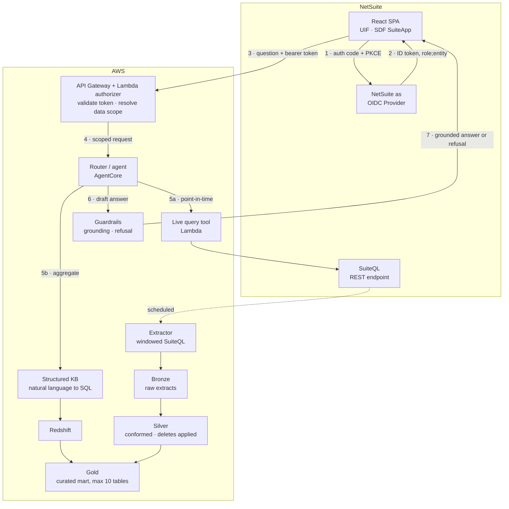

# WG Henschen — Preliminary Architecture (RAG over NetSuite)

Draft for the Friday 14 Aug send to David, ahead of the call next week. High-level picture and open questions only — no pricing.

Evidence base is [[wg-henschen-netsuite-integration-options]]; the constraints cited below are from Oracle and AWS documentation, not estimates. Scope context in [[wg-henschen-rag-scope-call-notes]].

## The decision this document exists to surface

Everything else here is fairly settled. This is not.

NetSuite enforces data access through roles — subsidiary, department, location, employee. When we query NetSuite directly, those restrictions apply automatically and correctly. **When we copy data into a warehouse to make it fast, they do not.** A data lake has no concept of a NetSuite role.

So there is a genuine fork, and it belongs to WG Henschen rather than to us:

| | Freshness | Permissions | Query cost | Aggregates |
|---|---|---|---|---|
| **Query NetSuite live** | Real-time | **Inherited automatically** | Slow; consumes a shared account-wide concurrency budget | Poor |
| **Replicate to a warehouse** | Batch — hourly or nightly | **Must be rebuilt** | Fast and cheap | Strong |

The architecture below does both and routes between them, because the two shapes of question genuinely want different answers. *"What is our total on-hand value by category this quarter"* is a warehouse question. *"How many of part 47-A do we have right now, and is any of it allocated"* is a live question — and it comes back correctly scoped to the asker without us writing any permission code at all.

What WG Henschen decides is **how much of their data goes into the warehouse**, because that determines how much of their permission model we have to reproduce. See *Permission model* below — it is the single largest cost variable in the engagement.

## Architecture at a glance

## Layer by layer

### 1. Interface — React SPA inside NetSuite

NetSuite has a first-class **Single Page Application** script type built on its User Interface Framework, with React support, packaged and deployed as a SuiteApp through the SuiteCloud Development Framework. This is a supported product feature, not a workaround, and it gives us three things we would otherwise build:

- A **Release Audience** setting that gates access by role, checked server-side when the app loads.
- **Center Links** to place the assistant in NetSuite's own navigation.
- Documented behaviour that the SPA *"always executes in the browser based on the currently logged-in user's role, regardless of the Execute As setting."*

Cost note: the SPA route requires an SDF SuiteApp project and a build chain that transpiles JSX and converts ES modules to AMD. SuiteApp packaging is not optional on this path.

### 2. Identity — authenticate against what they already have

Two viable issuers, and the choice is not cosmetic.

**NetSuite as OIDC Provider (recommended).** The user is already signed into NetSuite. The SPA performs an authorization-code + PKCE redirect and receives an RS256-signed ID token whose `sub` claim carries `role;entity`. Discovery at `/.well-known/openid-configuration`. ID token valid 3 hours.

**Their corporate IdP** (Entra ID, Okta) if one already federates into NetSuite.

The deciding criterion: a corporate IdP tells us *who someone is*; the NetSuite token tells us *what they are permitted to see*. Since NetSuite roles are where the data restrictions actually live, the NetSuite token is the one that does downstream work. If they want corporate SSO as well, use both — corporate IdP for authentication, NetSuite role for authorization.

**Explicitly ruled out:** OAuth 2.0 client credentials. It binds to one fixed entity-plus-role pair, which would collapse every user into a single service identity. Same hazard with the `Execute as Role` field on SuiteScript deployments — set to anything but the current user, and the whole per-user permission story fails silently, with no error. This needs to be a written architectural constraint carried into delivery, not tribal knowledge.

### 3. Access control — Lambda in front of Bedrock

API Gateway with a Lambda authorizer. It validates the token signature, extracts role and entity, resolves them into a data scope, and only then admits the request. No path from the browser to Bedrock bypasses it.

This is also where scope enforcement lives for warehouse queries, because — see below — the warehouse cannot enforce it for us.

### 4. Routing

The user should never choose a domain or a data source. The router classifies each question along two axes: which business domain (inventory, accounting, customer) and which retrieval path (live vs. mart). Built on **AgentCore Gateway** — Bedrock Agents Classic is closed to new customers, so the new-build path is AgentCore.

### 5a. Live path — point-in-time truth

A Lambda tool that issues a windowed SuiteQL query against NetSuite's REST endpoint under the calling user's token. Oracle documents that *"SuiteQL enforces the same role-based access restrictions used in SuiteAnalytics Workbook"* — so results are already filtered to what this user could see in NetSuite's own UI.

Constraint to design around: NetSuite governs API access by **concurrency, not rate**, from a single account-wide pool shared by every integration. The tier limits are 5 (Standard), 15 (Premium), 20 (Enterprise/Ultimate), plus 10 per SuiteCloud Plus license. On a Standard-tier account that is five concurrent requests for the entire company. The live path must therefore be queued and bounded, or it will degrade WG Henschen's other integrations. Their tier is an open question and it materially affects this design.

### 5b. Mart path — aggregates and trends

Bedrock's structured-data knowledge base converts a natural-language question into SQL, executes it, and generates the answer. Two hard product limits shape the whole data layer:

- **Amazon Redshift is the only supported query engine** — natively, or Glue Data Catalog through Redshift. Glue is the ETL and the catalog; it is not the query engine.
- **Maximum 10 tables, 100 columns per table, 60-second query timeout.**

A NetSuite instance has hundreds of tables. Ten is not a target to model toward, it is a ceiling. We treat this as a forcing function: it makes "what should this assistant be able to answer" an explicit design conversation held up front, rather than an open-ended one discovered in UAT.

Accuracy levers documented by AWS: per-table and per-column semantic descriptions, and curated natural-language/SQL example pairs.

### 6. Data platform — bronze, silver, gold

Standard medallion layering on S3, orchestrated by Glue.

**Bronze — raw extracts.** Recommendation: write a **custom SuiteQL extractor** rather than using Glue's Oracle NetSuite connector for the transaction and item objects. AWS documents that connector's date filter operators as unreliable on Item, Transaction Line, and Transaction Accounting Line — precisely the objects and precisely the filters an incremental sync depends on. It also caps at 100,000 records per extract. The connector may still be reasonable for smaller, better-behaved objects.

Every extract must be **windowed** regardless of method: SuiteQL returns at most 100,000 rows per query (1,000,000 if SuiteAnalytics Connect is licensed).

**Silver — conformed.** Typed, deduplicated, deletes applied. The documented change-detection contract is a hybrid and needs to be built as one:

- watermark on `last_modified_date` / `date_last_modified` for most tables;
- tombstones from the `deleted_records` table;
- and full reload every cycle for tables that support neither — Oracle names mapping tables specifically. That category is unbounded until we see their actual schema, which is the main argument for a sandbox spike before the number is final.

**Gold — the curated mart.** Wide, denormalized, at most 10 tables. Designed jointly with the client, because its shape defines the assistant's answerable surface.

### 7. Guardrails — the "I don't have that information" requirement

Bedrock Guardrails supports this natively through **contextual grounding checks**: independent grounding and relevance scores, thresholds configurable between 0 and 0.99, and a configurable blocked-message string that becomes the refusal text. Denied topics and PII filters layer on top, on both inbound and outbound.

**Caveat to raise with the client now rather than in UAT.** AWS documents contextual grounding as supported for summarization, paraphrasing and question answering, and states explicitly that *"Conversational QA / Chatbot use cases are not supported."* WG Henschen described a multi-turn chat assistant. The workable approach is per-turn, largely stateless grounding evaluation, and we should set that expectation in writing. Limits: 100,000 characters of grounding source, 1,000-character query, 5,000-character response. There is also a streaming caveat — an irrelevant answer can stream to the user in full before being flagged.

### 8. Data handling

Given the prior engagement's entire rationale was keeping patented drawings inside a controlled boundary, this should be an explicit commitment in the proposal rather than an implementation detail:

- Use a **geography-scoped inference profile** (`us.`), never `global.`
- Pin **zero data retention** (`data_retention_mode: none`) and verify it per model ID — some newer models require a provider-data-share mode that retains prompts up to 30 days.
- Claude Opus 5 and Sonnet 5 are both available on Bedrock.

## Permission model — the cost variable

Three options, cheapest first. This is the conversation to have with them.

**A. Scope phase one to broadly-visible data.** If inventory levels are visible to everyone who would use the tool, the problem is deferred entirely. Phase one covers inventory; accounting and customer data wait for phase two. Cheapest by a wide margin and the fastest route to something real in front of users.

**B. Tiered gold views.** A small number of security tiers, each with its own set of gold views; the Lambda routes the user to the right one based on their NetSuite role. Practical when the access pattern is coarse — a handful of tiers rather than per-user variation.

**C. Full restriction mirroring.** Reproduce NetSuite's restriction axes as row-level security in Redshift, keyed on the role and entity from the token. Faithful, and considerably more expensive to build and to keep correct as their roles change.

One escape route is closed: Bedrock's own documentation states that the include/exclude lists on a structured knowledge base are *"non-deterministic and intended for improving accuracy, not security."* They cannot be used as an access control. Enforcement must sit in the warehouse or in the Lambda.

**Recommendation:** open with A, design gold so that B remains reachable without rework, and treat C as a distinct phase with its own scope. That sequencing lets them see value before committing to the expensive part.

## Verification spikes — before any of this is a commitment

Roughly a day of work total. Each one is cheap now and expensive to discover later.

1. **CSP and CORS from inside a NetSuite SPA.** Nothing in NetSuite's documentation describes a content security policy — but absence of documentation is not absence of enforcement. A SPA making cross-origin calls to our API Gateway is the entire front-end architecture. Check the actual `Content-Security-Policy` and `X-Frame-Options` response headers on a rendered SPA page in a sandbox.
2. **The JWKS endpoint on their account.** The discovery document should expose `jwks_uri`; the validation procedure is not spelled out in the docs. Confirm against a real account before designing token validation.
3. **Whether REST record endpoints filter by role restrictions.** Documented for SuiteQL, not stated for record CRUD. Test empirically rather than assuming.
4. **Schema reconnaissance.** Custom record and custom field volume, and how many tables lack `last_modified_date`. This is what makes the sync estimate real rather than notional.

## Open questions — internal view

Why each one matters to us, ordered by how much it moves the design. The client-facing wording is in the next section.

1. **Who owns NetSuite internally?** Still unidentified, and it is the critical-path dependency — every question below needs an owner who can answer it. Internal administrator, or an outside NetSuite partner?
2. **A sandbox account with an integration role.** Not production. Half a day in a sandbox answers more than another two calls.
3. **Service tier, SuiteCloud Plus license count, and whether SuiteAnalytics Connect is licensed.** All three visible on one screen: Setup > Integration > Integration Management > Integration Governance. Sets the throughput ceiling for the live path.
4. **Which permission option — A, B, or C?** The largest single cost variable.
5. **Which modules beyond inventory, and how heavily customized?** Drives the gold mart design against the 10-table ceiling. Aerospace normally implies serialized and lot traceability, which is a different data shape than plain distribution.
6. **Is any part data export-controlled (ITAR/EAR)?** Aerospace. If yes, it constrains region, model selection, and data retention before anything else does. Not raised on the call; it should have been.
7. **Chat-only, or exportable output (CSV) as well?** Raised on the call, still open. Adds a deliverable if yes.
8. **OneWorld?** Determines whether subsidiary restrictions are in play — a whole axis of the permission model.

## Deliberately not decided here

- Sync frequency for the mart. Depends on how stale they can tolerate inventory being, which is a business answer.
- Gold mart table design. Requires their schema.
- Whether the live path needs its own caching layer. Depends on the tier answer in question 3.

---

# Questions for David

Copy-ready. Written to be forwarded to WG Henschen as-is.

Before we can put a credible shape and number on this, there are a handful of things we need from your side. Most are quick to answer; two need someone with NetSuite administrator access. We've grouped them and noted why each one matters, so you can route them to the right person.

## 1. Who owns NetSuite on your side?

**Question:** Who administers your NetSuite account day to day — someone internal, or an outside NetSuite partner? Can we get them into a call?

**Why we're asking:** Almost everything below needs an answer from whoever holds administrator access. Identifying that person is the single thing most likely to hold up the estimate.

## 2. Can we get a sandbox account?

**Question:** Can you provision a NetSuite **sandbox** (not production) account for us, with a role that has REST Web Services and SuiteAnalytics Workbook permissions?

**Why we're asking:** Half a day looking at the actual data model tells us more than several more calls. We need to see how much of your setup is standard NetSuite versus custom fields and custom records — that difference is one of the larger swings in effort, and we would rather measure it than guess at it.

## 3. Three numbers from one screen

**Question:** From **Setup > Integration > Integration Management > Integration Governance**, could your administrator send us a screenshot or the values for:

- your NetSuite **service tier** (Standard, Premium, Enterprise, or Ultimate);
- how many **SuiteCloud Plus** licenses you hold;
- whether **SuiteAnalytics Connect** is licensed on the account.

Also useful: is the account **OneWorld** (multiple subsidiaries)?

**Why we're asking:** NetSuite limits how many API requests can run at once, and that budget is shared across every integration you already have. It sets how fast the assistant can answer live questions, and it tells us whether we risk slowing down your existing integrations. The Connect licence, if you have it, meaningfully simplifies the data extraction.

## 4. Who should see what?

**Question:** Should the assistant show every user the same data, or should it respect each person's existing NetSuite permissions? Concretely: if a warehouse user and a controller both ask "what's our inventory value this quarter," should they get the same answer?

Related: roughly how many distinct levels of data access do you have? A handful of broad groups, or fine-grained restrictions per person, subsidiary, location, or department?

**Why we're asking:** This is the biggest single driver of cost and timeline in the project, so it's worth answering carefully. When the assistant queries NetSuite directly, your permissions apply automatically — we get that for free. When we copy data into a reporting layer to make the assistant fast and good at totals and trends, those permissions don't come with it and have to be rebuilt.

There's a sensible middle path: start with data that's broadly visible anyway (typically inventory), prove the tool works, and take on the stricter domains as a second phase. But we'd rather you make that call knowingly than have us assume it.

## 5. What should it be able to answer?

**Question:** Beyond inventory, which areas are in scope — accounting, customer data, purchasing, something else? And which NetSuite modules are you running (Advanced Inventory, WMS, Manufacturing, Demand Planning, Quality Management, others)?

If you can give us **ten to fifteen real questions** you'd want to ask the assistant on day one, in your own words, that would be the most useful single input we could get.

**Why we're asking:** The AWS service that handles numeric and aggregate questions has a hard limit on how many tables it can reason over, so we have to design a focused data model rather than exposing all of NetSuite. Real example questions are how we make sure the right things are in it. It's also how we'll measure whether the finished tool is actually good.

## 6. Is any of your part data export-controlled?

**Question:** Is any part, drawing, or customer data subject to **ITAR or EAR** export control, or covered by CMMC or similar obligations?

**Why we're asking:** If yes, it constrains our choices about where data is processed and stored before anything else does — so we need to know now rather than late. It's the same class of concern that drove the architecture on the drawings project.

## 7. Chat only, or files too?

**Question:** Is a conversational answer on screen sufficient, or do users also need to export results — a CSV of matching parts, a report they can send on?

**Why we're asking:** Straightforward to build, but it's an additional deliverable and we'd rather price it in than discover it later.

## 8. Where does the assistant live?

**Question:** You mentioned embedding the chat inside NetSuite. Do you have a preference for **where** it appears — its own item in the NetSuite menu, a panel on the dashboard, or alongside specific record pages?

**Why we're asking:** NetSuite supports all three; they differ in effort and in how naturally the tool fits into people's existing work.

---

## What we'll do with the answers

Once we have 1, 2, and 3, we can validate the technical approach directly against your environment and come back with a concrete architecture and a phased estimate. Questions 4 and 5 are the ones we'd most like to talk through live on next week's call rather than over email — they're judgement calls about scope, not facts to look up.
